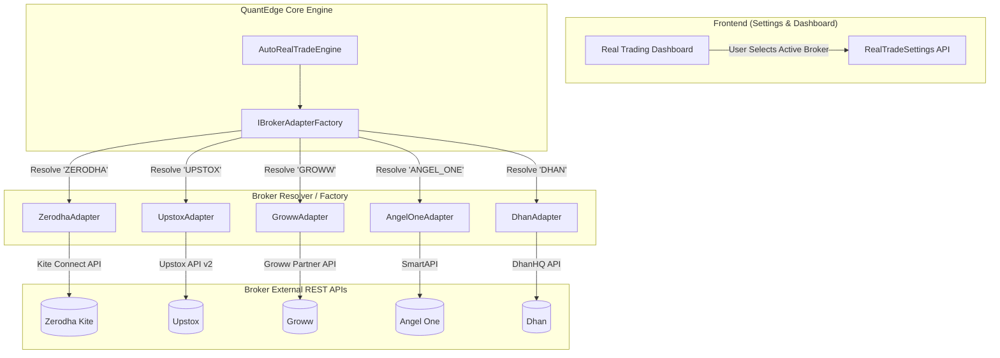

# Multi-Broker Architecture Plan (Zerodha, Upstox, Groww, Angel One, Dhan)

## 📌 Overview
This design document details the future multi-broker integration plan for **QuantEdge**, enabling plug-and-play addition of multiple Indian stock brokers (Zerodha, Upstox, Groww, Angel One, Dhan) using the **Adapter Pattern** and **Factory Pattern** without touching core auto-trading algorithms, risk checks, or dashboard logic.

---

## 🏗️ 1. High-Level Architecture



---

## 🧩 2. Core Components to Implement

### A. Common Standard Broker Interface (`IBrokerAdapter`)
A uniform abstraction for all brokers:

```csharp
namespace QuantEdge.Infrastructure.Interfaces;

public interface IBrokerAdapter
{
    string BrokerCode { get; } // "ZERODHA", "UPSTOX", "GROWW", "ANGEL_ONE", "DHAN"
    string BrokerDisplayName { get; } // "Zerodha Kite", "Upstox Pro", "Groww Trade", etc.
    
    Task<(bool IsValid, string? Message)> ValidateSessionAsync(int userId);
    Task<(bool Success, string? OrderId, decimal ExecutedPrice, string? Message)> PlaceOrderAsync(BrokerOrderRequestDto request);
    Task<(bool Success, string? Message)> CancelOrderAsync(string brokerOrderId, int userId);
    Task<(bool Success, string? OrderId, decimal ExecutedPrice, string? Message)> SquareOffPositionAsync(string symbol, int qty, TradeSide side, string product, int userId);
    Task<(bool Success, decimal AvailableMargin, decimal UsedMargin, string? Message)> GetMarginsAsync(int userId);
    Task<(bool Success, ZerodhaPositionsDto? Positions, string? Message)> GetPositionsAsync(int userId);
    Task<(bool Success, List<ZerodhaHoldingDto>? Holdings, string? Message)> GetHoldingsAsync(int userId);
}
```

---

### B. Concrete Broker Adapters
Each broker implementation lives in its own dedicated class:

1. **`ZerodhaAdapter.cs`**
   - Protocol: Kite Connect REST API v3
   - Auth: Request Token -> Access Token Exchange
2. **`UpstoxAdapter.cs`**
   - Protocol: Upstox API v2 (`api.upstox.com/v2`)
   - Auth: OAuth 2.0 Authorization Code Flow
3. **`GrowwAdapter.cs`**
   - Protocol: Groww Trade API
   - Auth: API Key / JWT Session Token
4. **`AngelOneAdapter.cs`**
   - Protocol: SmartAPI (Angel One)
   - Auth: Client Code + Password + TOTP Authentication
5. **`DhanAdapter.cs`**
   - Protocol: DhanHQ API v2
   - Auth: Client ID + Permanent Access Token

---

### C. Broker Factory (`BrokerAdapterFactory`)
Dynamically resolves the active adapter at runtime:

```csharp
public class BrokerAdapterFactory : IBrokerAdapterFactory
{
    private readonly IEnumerable<IBrokerAdapter> _adapters;

    public BrokerAdapterFactory(IEnumerable<IBrokerAdapter> adapters)
    {
        _adapters = adapters;
    }

    public IBrokerAdapter GetAdapter(string brokerCode)
    {
        return _adapters.FirstOrDefault(a => a.BrokerCode.Equals(brokerCode, StringComparison.OrdinalIgnoreCase))
               ?? throw new NotSupportedException($"Broker '{brokerCode}' is not supported or not configured.");
    }

    public IEnumerable<string> GetSupportedBrokers()
    {
        return _adapters.Select(a => a.BrokerCode);
    }
}
```

---

### D. Database & Session Schema Extensions

#### 1. Table `real_trade_settings`:
Add column:
```sql
ALTER TABLE real_trade_settings 
ADD COLUMN active_broker VARCHAR(30) DEFAULT 'ZERODHA';
```

#### 2. Table `broker_sessions` (Unified Multi-Broker Sessions):
```sql
CREATE TABLE IF NOT EXISTS broker_sessions (
    id SERIAL PRIMARY KEY,
    user_id INT NOT NULL,
    broker_code VARCHAR(30) NOT NULL, -- 'ZERODHA', 'UPSTOX', 'GROWW', 'ANGEL_ONE', 'DHAN'
    api_key VARCHAR(100),
    api_secret VARCHAR(100),
    access_token TEXT NOT NULL,
    refresh_token TEXT,
    created_at TIMESTAMP WITH TIME ZONE DEFAULT CURRENT_TIMESTAMP,
    expires_at TIMESTAMP WITH TIME ZONE,
    is_active BOOLEAN DEFAULT TRUE,
    UNIQUE(user_id, broker_code)
);
```

---

### E. Frontend UI Additions
1. **Risk & Settings Screen:**
   - Dropdown: **"Active Trading Broker: [ Zerodha Kite ▾ | Upstox Pro | Groww Trade | Angel One | Dhan ]"**.
   - Dynamic 1-Click Connect Button (e.g. "⚡ Connect Upstox" or "⚡ Connect Zerodha").
2. **Dashboard Master Header:**
   - Active broker badge showing current live session status.

---

## 🎯 3. Key Benefits

1. **Plug-and-Play Integration**: Adding a new broker requires only 1 new adapter class without modifying scanner logic, position tracking, stop-loss calculations, or SignalR events.
2. **Broker Redundancy**: If one broker is facing API downtime or maintenance, switch to another broker with 1 click.
3. **Multi-User Multi-Broker**: Different users can trade using different brokers simultaneously.
