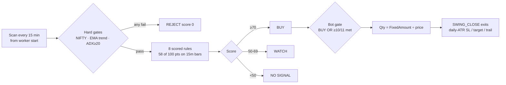
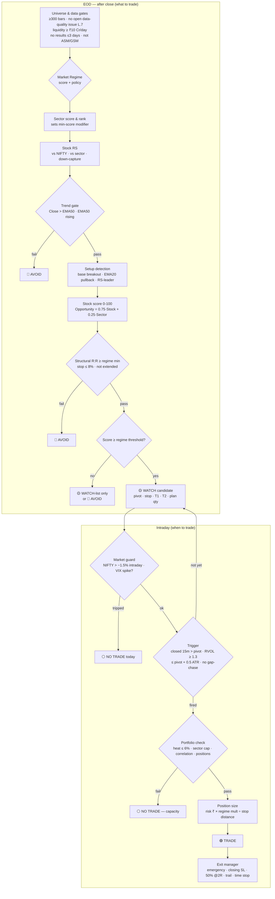
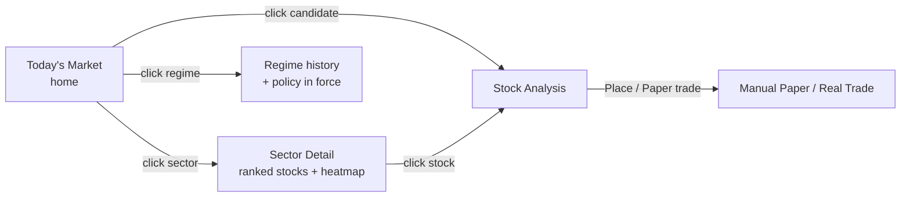
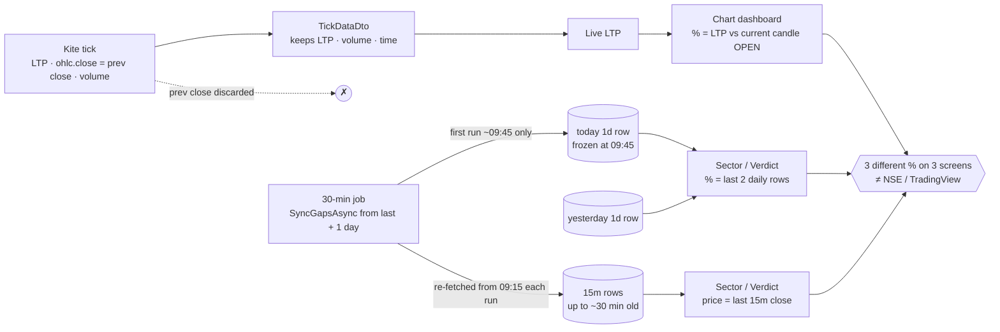
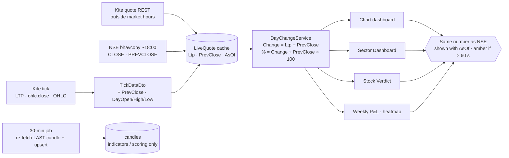
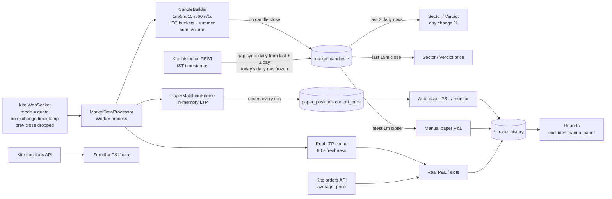
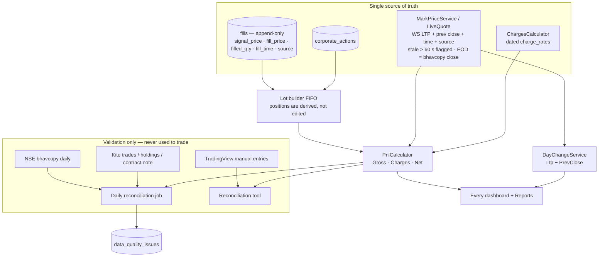
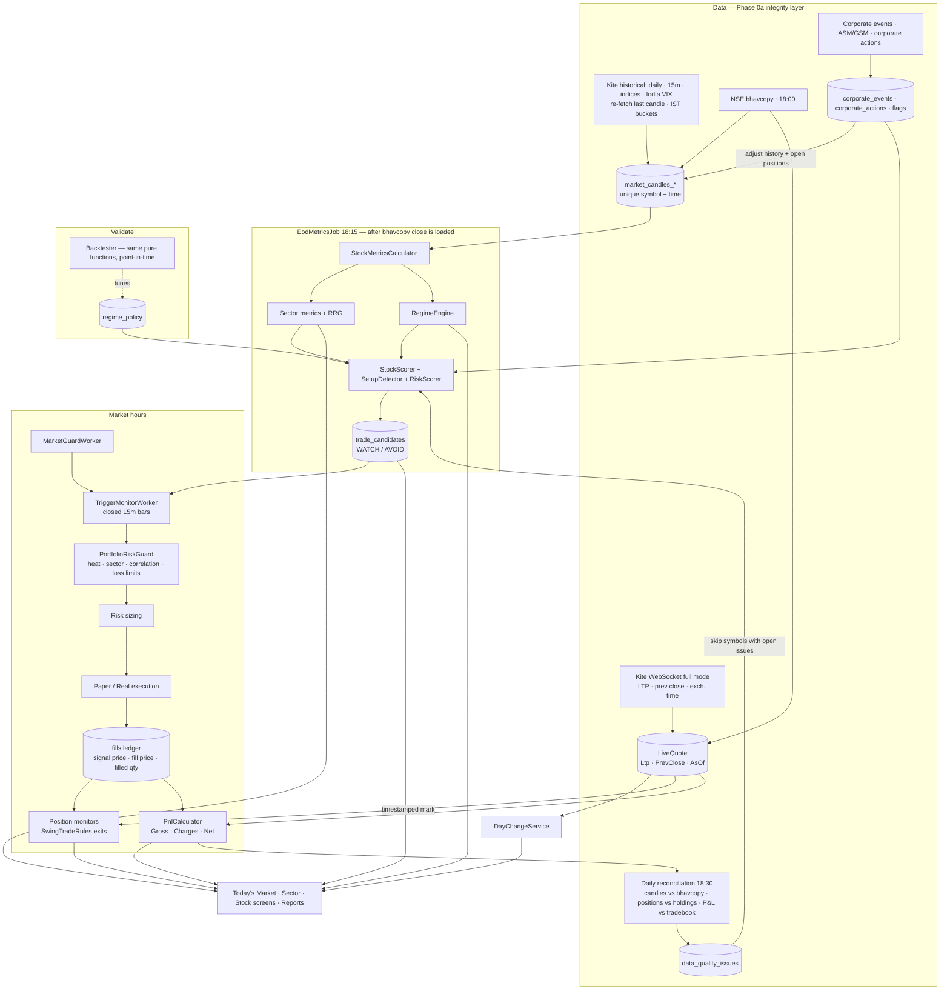

# QuantEdge — Swing Strategy Review & Redesign

**Status:** Proposal for review. Nothing in here is implemented yet.
**Scope:** `SwingDecisionEngine`, `SwingTradeRules`, `SectorDashboardService`, the auto paper/real entry gates, the backfill/analysis path, and the dashboards built on them.
**Short version:** the exit side is solid. The entry side scores the last few hours of price action, not the quality of a swing setup. The NIFTY gate is a blunt on/off switch that blocks exactly the stocks you want in a weak market. Sizing ignores risk. A few data bugs also make some indicators meaningless. Fix the data first, then rebuild the decision layer as **Regime → Sector → Relative Strength → Setup → Trigger → Size → Exit**.

### Implementation status (updated 07-Oct-2026)

| Item | Status | Notes |
|---|---|---|
| **L.0** Day change = LTP − previous close everywhere | ✅ Done | `live_quotes` table fed by the feed worker (`LiveQuoteRecorder`, 2 s batches) · `DayChangeCalculator` + `DayQuoteService` · Sector Dashboard, Stock Verdict, chart header, weekly widget · `GET /api/marketdata/day-quote/{symbol}` |
| L.0 fix 4: daily gap sync re-fetches the last day | ✅ Done | `ZerodhaHistoricalDataService.SyncGapsAsync` |
| L.0 fix 5: "today" resets use the IST day | ✅ Done | `TimeZoneHelper.IstTodayStartUtc()` in the reset worker, delete-today and create-today paths |
| **P1** closing paper trade booked ₹0 in history | ✅ Done | `PaperPositionCloser` (market + limit paths) · one-time backfill script `Persistence/data_fixes/2026-10-06_paper_close_history_pnl.sql` |
| **P2** paper partial close ignored / margin wrong | ✅ Done | Partial closes reduce quantity and release margin proportionally; overselling is rejected |
| **P3** Reports missing manual paper trades | ✅ Done | Both report SQL functions + "Manual Paper Trading Only" filter |
| Kite API rate safety | ✅ Done | Today's daily row is rebuilt from stored 15m candles (DB only), so there are no extra Kite calls · process-wide gate: ≥ 350 ms between historical requests |
| **P4/P5** real filled quantity / fill price | ✅ Done | `RealFillResolver`: positions and P&L use Zerodha's `filled_quantity` and `average_price`; no fallback to the live price. Partly-filled-then-cancelled orders now open, shrink or close the position (before: treated as "nothing happened"). SL/target re-anchored to the fill on reconcile. New `real_orders.signal_price` / `filled_quantity` for slippage. **0 extra Kite calls.** Real Trade Flow diagrams updated |
| **P6** charges (Gross / Charges / Net) | ✅ Done (Reports) | `ChargesCalculator` + dated `charge_rates` table (built-in Zerodha defaults if missing) · CNC rates, MIS for a same-day round trip · Reports: KPI, trade table, periods, equity curve and CSV use **net** · 0 Kite calls. Still gross: live position cards on the Real / Paper / Manual pages (next), and the report's profit/loss filter (applied in SQL on gross) |
| **Zerodha failure notifications** | ✅ Done | `KiteApiFailureHandler` on the Kite HttpClient (every REST call: non-2xx, 429 rate limit, network error) + hooks for historical sync, live-feed drop/error and calls skipped for no valid session (market hours) → `broker_api_events` (5-min de-dup with repeat count) → header bell "Zerodha" category + instant SignalR refresh · 0 extra Kite calls |
| P6 follow-ups | ✅ Done | Report Profit/Loss filter on **net** · **actual charges** for real trades: `RealOrderChargesWorker` (after 15:45 IST) → Kite `POST /charges/orders`, 1 batched call per user per day, 7-day catch-up → `real_order_charges` (+DP per scrip per sell day); Reports tag each trade **actual / est.** · live pages show "net … after charges" for open positions and totals (Real, Auto Paper, Manual Paper) |
| **P11** price age | ✅ Done | Open positions carry `PriceSource` (LIVE / BROKER / STORED / NONE) + `PriceAsOfUtc`; pages show "—" instead of a fake ₹0 when there's no price, and an amber "stored price · 5m old" / "broker quote" tag when not live |
| **P7/P8** live volume & IST candle buckets | ✅ Done | Tick volume = change in Kite's cumulative day volume (computed in delivery order, late ticks ignored) · candles bucketed in IST from 09:15 (60m = 09:15, 10:15 …), daily at 00:00 IST = Kite's stamp, so live and synced candles share one row · clean-up script `data_fixes/2026-10-06_candle_alignment_cleanup.sql` for old duplicate/misaligned rows |
| **P9** NSE bhavcopy | ✅ Done | `NseBhavcopyWorker` (plain `marketdatafeed` process, from 18:30 IST, retries every 30 min, 5-day catch-up) → `nse_bhavcopy`; the day's daily candles are set to NSE's **official** OHLC/volume · NSE download, 0 Kite calls |
| **P10** splits / bonuses | ✅ Done | Detected from NSE's adjusted previous close in the bhavcopy (`corporate_actions`); simple ratios auto-applied to older candles (all timeframes) and open paper/manual/real positions, indicators recomputed; unusual ratios flagged in the bell for review |
| **P12 + reconciliation** | ✅ Done | Daily: stored close vs NSE official close (>0.5% → `data_quality_issues`) and open real positions vs Zerodha holdings+positions after the close (2 Kite calls per user/day) · **Reconciliation page** (menu): live compare on demand (cached 60 s) + last 7 days of issues |
| Fills ledger (append-only) | ⏳ Partly | Orders now store signal price + filled quantity and actual charges; a separate append-only fills table (FIFO lots) is not built yet — only needed for multi-lot positions |
| **Phase 0b** strategy data correctness | ✅ Done | **D1** 300 daily candles everywhere (scan workers, Sector, Verdict, Swing, NIFTY); EMA200 check skipped (not faked) under 220 bars · **D2** unfinished 15m/60m candles never scored + scans wake 20 s after each 15-min close · **D3** volume vs the same time slot on earlier days (opening bar no longer free points) · **D6** dashboards show the stop/target the bot actually places · **D10** hard-coded sector map removed (Swing dashboard uses `stock_sectors`) · **D11** NIFTY return on the stock's own dates · **D5** risk-based size on **Auto Paper** (min of fixed ₹ cap and 1% capital risk) |
| D5 on **real money** | ⏸ Your decision | Same rule ready (`SwingTradeRules.RiskSizedQuantity`); not switched on for real orders because real `AvailableCapital` (default ₹2,000) would shrink or block orders — enable after paper results / once capital is set correctly |
| D4 R:R always passes · D7 stop cap · D8 two BUY gates · D9 backtest path | ⏳ Phase 4–5, 7 | Part of the strategy redesign (structural R:R gate, single decision path, point-in-time backtest) |
| **Phase 1** market regime | ✅ Done (off by default) | `MarketRegimeEngine`: score 0–100 = trend 40 + breadth 35 (active-stock universe, point in time) + volatility 15 (India VIX, else NIFTY ATR% percentile) + drawdown 10 → 5 regimes, 2-day confirmation (a −3% day / VIX > 25 → STRONG_BEARISH at once) · `market_regime_daily` (60-day backfill, recomputed after the NSE bhavcopy) · editable `regime_policy` (min stock score, must beat NIFTY, max positions, risk %) · **Market gate** in Swing settings: `NIFTY_FILTER` (old rule, default) or `REGIME` — in REGIME mode both scan workers, Sector Dashboard and Stock Verdict use the policy, so strong stocks can still be bought in a weak market · fails closed (no regime → no new buys) · regime card + banner on the Sector Overview, `GET /api/market/regime` · DB only, **0 Kite calls** |
| **Phase 7** backtesting | ✅ Done (moved ahead of 2–6) | **Backtest page** (menu) → `backtest_runs` queue → `BacktestWorker` (plain `marketdatafeed` process; 1 low-priority thread in market hours, up to 4 after) · point-in-time replay of the **live** `SwingDecisionEngine` at every stored 15m close (last 100 closed 15m/60m bars, 299 daily + today's bar built from 15m, NIFTY the same way) · same NIFTY or regime gate, same guards (held, trade cap, loss limit, max positions, cash, size, ≥2% drift), entry at next 15m open + slippage, exits through `SwingTradeRules.EvaluateExit` on 15m bars (stop-first when a bar touches both), Zerodha charges · result: verdict vs the go-live rule (≥30 trades, ≥ +0.2R, both halves positive), expectancy R, win rate, PF, drawdown, equity curve, by half/year/regime/exit/score/sector, **threshold sweep** 60–90, **factor edge**, data coverage, suspected unadjusted splits excluded, CSV · tests: no look-ahead (truncated data gives identical signals), exits on hand-built bars, guards, charges, EMA pre-check == engine (2,080/2,080) · stored candles only, **0 Kite calls** |
| Phases 2–6 (strategy) | ⏳ Not started | Next: run the backtest on real data, then let its factor-edge / sweep results decide what Phases 2–5 change |

**Rule for every phase: no extra Zerodha calls.** Kite limits are about 3 req/s for historical, 1 req/s for quotes and 10 req/s for other endpoints, shared by every worker. Derive from Postgres or the live WebSocket tick first. Batch (one quote call for many symbols). Piggyback on calls that already run. State the call-count impact of every change.

**Work order:** section **L (market data & P&L integrity)** comes first. Several P&L numbers on the site are provably wrong or incomplete (L.1). Until they reconcile with NSE / broker data, no backtest or strategy comparison can be trusted.

> The weights and thresholds proposed below are starting values based on common practice, not proven numbers. Phase 7 (backtesting) has to confirm them before real money depends on them.

---

## A. Current Strategy Review

### A.1 How it works today



### A.2 Data and correctness bugs (fix these before changing any strategy)

| # | Problem | Where | Impact |
|---|---|---|---|
| D1 | **Only 100 daily candles are loaded.** `CalculateEma(…, 200)` on 100 values returns a running cumulative average, so `ema200Stable` is not checking an EMA200 at all. The "52-week high" is really a 100-day (~5-month) high. | [RealTradeSchedule.cs:15](../QuantEdge.Infrastructure/Constants/RealTradeSchedule.cs#L15), [AutoTradeSignalScanWorker.cs:153](../QuantEdge.Worker/Workers/AutoTradeSignalScanWorker.cs#L153), [SwingTradingService.cs:120](../QuantEdge.Infrastructure/Services/SwingTradingService.cs#L120) | EMA200 and 52W filters are fiction. The NIFTY filter has only ~50 bars of EMA50 warm-up. |
| D2 | **Forming candles are scored as if closed.** Candles are upserted live, and the auto scan runs every 15 min from *worker start*, not on 15m boundaries. The last 15m bar can be 2 minutes old. | [AutoTradeSignalScanWorker.cs:21](../QuantEdge.Worker/Workers/AutoTradeSignalScanWorker.cs#L21) | Volume multiple, candle shape, RSI and MACD all repaint. A BUY can disappear by the bar close. |
| D3 | **Opening-bar volume bias.** The 15m volume test compares the current bar with the previous 20 bars, which include the previous afternoon. The 09:15 bar is normally 3–5× an average bar. | [SwingDecisionEngine.cs:238](../QuantEdge.Infrastructure/Services/SwingDecisionEngine.cs#L238) | The 09:30–09:45 scans hand out the 15-point volume score almost for free. |
| D4 | **The R:R rule always passes.** `Target1 = price + 2 × risk`, so R:R is 2.0 by construction (apart from rounding). | [SwingDecisionEngine.cs:386](../QuantEdge.Infrastructure/Services/SwingDecisionEngine.cs#L386) | 7 free points. Risk/reward is never really evaluated, and no resistance is considered. |
| D5 | **The engine sizing is ignored.** The engine sizes on a hard-coded ₹10L / 1% risk. Both bots then use `FixedAmountPerTrade ÷ price`. `MarketContextPositionSizeFactor` is therefore cosmetic. | [SwingDecisionEngine.cs:441](../QuantEdge.Infrastructure/Services/SwingDecisionEngine.cs#L441), [AutoTradeService.cs:404](../QuantEdge.Infrastructure/Services/AutoTradeService.cs#L404), [AutoRealTradeService.cs:559](../QuantEdge.Infrastructure/Services/AutoRealTradeService.cs#L559) | Rupee risk per trade varies 3–4× with volatility. A 4%-ATR stock risks 4× more than a 1%-ATR stock. |
| D6 | **Two different level sets.** The dashboard shows SL/target from the *15m* ATR (often only ~0.5% away). The bot places SL/target from the *daily* ATR. | Engine vs [SwingTradeRules.cs:218](../QuantEdge.Infrastructure/Services/SwingTradeRules.cs#L218) | The levels you see on screen are not the levels that get traded. |
| D7 | **The stop cap moves the stop closer.** When 1.5 × ATR is more than 8%, the stop is pulled *in* to 8%, inside the stock's normal noise. | [SwingTradeRules.cs:218](../QuantEdge.Infrastructure/Services/SwingTradeRules.cs#L218) | Volatile stocks get stopped out by ordinary noise. Such a trade should be skipped, not tightened. `InferAtr` then works back from the capped stop and gets the ATR wrong. |
| D8 | **Two parallel BUY gates.** Score ≥ 70 *or* ≥ 10 of 11 checklist items met. The checklist count includes the hard filters and the always-true R:R item. | [AutoTradeService.cs:324](../QuantEdge.Infrastructure/Services/AutoTradeService.cs#L324), [SectorDashboardService.cs:278](../QuantEdge.Infrastructure/Services/SectorDashboardService.cs#L278) | Nobody can explain exactly why something was bought. |
| D9 | **The backtest/backfill runs a different strategy.** `BackfillHistoricalAnalysesAsync` calls the overload without 15m data, so all "15m" rules run on daily bars. `AnalyzeStockForDateAsync` loads the *latest* candles and NIFTY data, not the data as of `tradeDate`, and uses default settings instead of the DB settings. | [SwingTradingService.cs:762](../QuantEdge.Infrastructure/Services/SwingTradingService.cs#L762), [SwingTradingService.cs:1018](../QuantEdge.Infrastructure/Services/SwingTradingService.cs#L1018) | There is no valid historical evidence for the live rules. |
| D10 | **Hard-coded sector switch.** `GetSectorForSymbol` maps about 25 symbols; everything else becomes "General Equities". The real mapping is already in `stock_sectors`. | [SwingDecisionEngine.cs:559](../QuantEdge.Infrastructure/Services/SwingDecisionEngine.cs#L559) | Wrong sector labels. |
| D11 | **The RS calculation compares misaligned dates.** It uses the live stock price against NIFTY's last stored close, with no date alignment. | [SwingDecisionEngine.cs:264](../QuantEdge.Infrastructure/Services/SwingDecisionEngine.cs#L264) | A stale NIFTY row skews relative strength. |
| D12 | **Defaults can over-commit.** ₹1,00,000 capital, ₹20,000 per trade and 10 concurrent positions add up to ₹2,00,000. Only the cash/margin check stops it. | `AutoTradeSettings`, [SwingTradeRules.cs:100](../QuantEdge.Infrastructure/Services/SwingTradeRules.cs#L100) | Exposure is not controlled by design. |

### A.3 Strategy-level critique

1. **The "swing" score is mostly an intraday score.** 58 of the 100 points (breakout, volume, RSI, MACD, candle, R:R) are measured on the 15m bar. A swing candidate's quality should not move from 85 to 40 because one 15-minute candle closed red. Daily bars should decide *what* to trade. Intraday bars should only decide *when* to enter.
2. **Most factors measure the same thing.** EMA trend, the 60m trend, 15m RSI, 15m MACD, the bullish candle and the breakout group all ask "did price go up recently?". The score looks like 8 independent opinions but is really 1–2. That redundancy inflates confidence.
3. **The breakout group is too loose.** "Within 10% of the 52W high" (really the 100-day high, see D1) counts as a breakout. Almost every stock that passes EMA_TREND already gets those 20 points.
4. **There is no extension filter.** The strategy requires Price > EMA20 > EMA50 but never asks *how far* above. It will happily buy a stock 4 ATR above its EMA20, which is the worst point to enter.
5. **The ADX ≥ 20 hard gate rejects the best entries.** Stocks breaking out of a tight base usually have *low* ADX, because the base was flat. ADX belongs in the score, not in a gate.
6. **Relative strength is binary and short.** A stock that is 0.1% ahead of NIFTY over one month gets the same 15 points as a stock that is 13% ahead. There is no comparison with the sector, no percentile, and no persistence over time.
7. **The NIFTY gate is binary and lagging.** "Close > SMA50 and EMA20 > EMA50" flips late in both directions, and it blocks *every* stock. Soft mode applies a flat −10 to *every* stock, which does not separate leaders from laggards. Neither mode answers your question 2.
8. **Sector strength is a one-day number.** It is today's change plus today's advance/decline count ([SectorDashboardService.cs:325](../QuantEdge.Infrastructure/Services/SectorDashboardService.cs#L325)). A sector that has led for three weeks becomes WEAK on one red day, and a BUY gets demoted to WATCH. That is noise for a 5–20 day holding period.
9. **Basic swing filters are missing:** liquidity (average traded value), upcoming results/corporate events, ASM/GSM/circuit-band stocks, and gap-at-open handling for entries.
10. **Exits cap the winners.** A full exit at 3 × ATR removes the right tail that pays for a momentum strategy. Taking part of the position at about 2R and trailing the rest is the standard fix.
11. **Risk limits are loose.** A 10% daily loss limit is about 5× what professional desks use. There is no limit on total open risk (portfolio heat), no sector cap and no correlation check.

### A.4 Look-ahead bias, leakage and overfitting

| Issue | Type | Fix |
|---|---|---|
| Forming candles scored as closed (D2) | Repainting. A backtest on final candles would see "better" signals than live trading could. | Evaluate only closed bars; align scans to 15m boundaries + 20 s. |
| `AnalyzeStockForDateAsync` reads the latest candles for a past date (D9) | Look-ahead | Every query must be point-in-time (`candle_time <= asOf`). |
| Backfill enters at the close of the signal bar | Mild look-ahead | Enter at the next open, or treat entry as a last-30-min decision priced at the close + slippage. |
| Universe = today's active stocks, today's sector members | Survivorship bias | Store universe and sector membership history; at minimum, flag results as survivorship-biased. |
| Thresholds 70/50 and the weights are hand-picked and never validated | Unknown edge rather than classic overfitting | Use fewer parameters, round numbers, and the sensitivity tests in Phase 7. |
| Live price vs stale NIFTY row (D11) | Misalignment | Align every series on trading date before computing returns. |

### A.5 Intraday vs swing

They are different strategies and should not share a score.

| | Swing (this system) | Intraday |
|---|---|---|
| Decides *what* | Daily bars, computed after the close (EOD) | Pre-open scanner, gap, opening range |
| Decides *when* | 15m closed bar or last-30-min confirmation | 1m/5m, VWAP, opening-range breakout |
| Hold | 3–20 trading days | Same day |
| Stops | Daily ATR, closing basis + emergency stop (already built) | Tight, live, VWAP/ORB-based |
| Useful indicators | EMA 20/50/200, RS, ATR, base/pivot, volume accumulation | VWAP, RVOL by time of day, ORB |

`ExitMode = INTRADAY` today is not an intraday strategy; it is tighter exits on a swing entry. Keep `SignalScoreCalculator` (VWAP etc.) for a separate intraday product and keep it out of swing decisions.

### A.6 Rule-by-rule verdict

| # | Existing rule | Verdict | Why |
|---|---|---|---|
| 1 | NIFTY hard filter (Close > SMA50 & EMA20 > EMA50 blocks everything) | ⚠️ Modify | Replace with the Market Regime Engine (H). The regime sets thresholds and size; it is not an on/off switch, except optionally in STRONG BEARISH. |
| 2 | Soft mode −10 penalty / 0.5× size | ❌ Remove | A flat penalty cannot separate leaders from laggards, and the size factor is never applied (D5). Superseded by regime policy. |
| 3 | EMA_TREND hard gate (Price > EMA20 > EMA50, slopes, EMA200 stable) | ⚠️ Modify | Gate = Close > EMA50 and EMA50 rising. EMA20 and EMA200 move into the score. EMA200 needs 300 bars (D1). The current gate also rejects pullback entries. |
| 4 | ADX ≥ 20 hard gate | ⚠️ Modify | Move to the score (with +DI > −DI). Do not penalise base breakouts. |
| 5 | BREAKOUT_GROUP (20 pts, 15m) | ⚠️ Modify | Becomes a daily *setup* (base + pivot) plus an intraday *trigger*. Drop "within 10% of the 52W high" as a breakout. |
| 6 | VOL_CONFIRMATION (15m vs previous 20 bars) | ⚠️ Modify | The trigger uses time-of-day RVOL (D3). The score uses daily accumulation (up/down volume). |
| 7 | RELATIVE_STRENGTH (binary 1M vs NIFTY, 15 pts) | ⚠️ Modify | Becomes the main factor (30 pts): percentile rank, multiple horizons, vs NIFTY and vs sector, RS-line high, down-capture. See C.2. |
| 8 | MULTITIMEFRAME (60m > EMA20, RSI ≥ 40) | ⚠️ Modify | Remove from the score. Optionally keep as a trigger sanity check. |
| 9 | RSI_MOMENTUM (15m 50–75) | ❌ Remove | 15m RSI is noise for a swing hold and duplicates rule 6. Use daily RSI as a small momentum input. |
| 10 | MACD_BULLISH (15m) | ❌ Remove | Duplicates the EMA trend and RSI. |
| 11 | BULLISH_CANDLE (15m) | ❌ Remove from score | "Close in the upper part of the bar" becomes one condition of the trigger bar. |
| 12 | RISK_REWARD (7 pts, always passes) | ❌ Remove → ➕ Add as a gate | Real R:R uses a structural stop and the nearest resistance (E.3). |
| 13 | Score ≥ 70 BUY / ≥ 50 WATCH | ⚠️ Modify | Thresholds depend on the regime. A score only creates a *candidate*; TRADE also needs the trigger. |
| 14 | MinConditionsMatch (≥ 10/11) as an alternative BUY path | ❌ Remove | Two gates make the decision unexplainable (D8). |
| 15 | Already-open dedupe (BUY → WATCH) | ✅ Keep | Correct. |
| 16 | Engine SL = 1.5 × 15m ATR, T1/T2 = 2R/3R | ❌ Remove | One level set only, from the daily structure (D6). |
| 17 | SWING_CLOSE closing-basis stop | ✅ Keep | A professional design: intraday noise cannot shake the trade out. |
| 18 | Emergency live stop (SL + 1 ATR, cap 12%) | ✅ Keep | A necessary circuit breaker. |
| 19 | Trail: activates at +1 ATR from breakeven, 3 ATR trail, never on day 1 | ✅ Keep · ⚠️ tighten by regime | Sensible. Use a 2 ATR trail in BEARISH or worse. |
| 20 | Full exit at target = 3 × ATR | ⚠️ Modify | Take 50% at 2R and move the stop to breakeven; trail the rest. |
| 21 | Max hold 20 days | ✅ Keep + ➕ time stop | Add: not at +1R after 10 days → exit at the close. |
| 22 | Signal drift ±2% | ✅ Keep · ⚠️ express in ATR | Max 0.5 ATR above the pivot. A 2% band means different things for a 1%-ATR and a 4%-ATR stock. |
| 23 | Entry delay 15 min | ✅ Keep | Avoids the opening auction noise. |
| 24 | Daily loss limit default 10% | ⚠️ Modify | 2% of equity for the day, 4% for the week. |
| 25 | Max 10 concurrent positions (constant) | ⚠️ Modify | Set per regime (H). |
| 26 | Fixed ₹ amount per trade | ❌ Remove | Size from risk: `qty = risk₹ ÷ (entry − stop)` (E.5). |
| 27 | 8% max stop (pulls the stop in) | ⚠️ Modify | If the structural stop is > 8% (> 10% for small caps), **skip the trade**. |
| 28 | 1% minimum ATR floor | ✅ Keep | Harmless guard. |
| 29 | Sector WEAK today demotes BUY to WATCH | ⚠️ Modify | Use the multi-horizon sector score (F). An exceptional RS stock may override a weak sector. |
| 30 | Sector strength = day change + breadth | ⚠️ Modify | Keep it only as a "Today" column for context. |
| 31 | `GetSectorForSymbol` switch | ❌ Remove | Use `stock_sectors` plus a primary-sector flag. |
| 32 | 100 daily bars loaded | ⚠️ Fix | Load ≥ 300 bars (D1). |
| 33 | 15-minute scan aligned to worker start | ⚠️ Fix | Run on closed bars only (D2). |
| — | Market regime engine | ➕ Add | H |
| — | Percentile RS, RS vs sector, down-capture | ➕ Add | C.2 |
| — | Multi-horizon sector score + rotation quadrant | ➕ Add | F |
| — | Base/pivot detection, extension filter | ➕ Add | E.1 |
| — | Liquidity, results-date, ASM/GSM/circuit filters | ➕ Add | E.1 |
| — | Portfolio heat, sector cap, correlation cap, drawdown throttle | ➕ Add | E.6 |
| — | Point-in-time backtest of the *same* code | ➕ Add | Phase 7 |

---

## B. Missing Logic (summary)

1. **Market regime** with policy: thresholds, position count, risk %, exposure and allowed setups per regime.
2. **Relative-strength ranking** across the universe (percentile), vs sector, RS-line new highs, and behaviour on NIFTY down-days.
3. **Multi-horizon sector ranking** (trend, RS, momentum, breadth, volume) plus rotation (Leading / Weakening / Lagging / Improving).
4. **Setup detection:** base/pivot, pullback to EMA20, tightness, extension.
5. **Separation of *what* (EOD) from *when* (intraday trigger).**
6. **Structural stops and resistance-aware R:R** as a gate.
7. **Risk-based sizing** and portfolio-level risk: heat, sector, correlation, drawdown.
8. **Event and tradability filters:** results dates, liquidity, ASM/GSM, circuit bands.
9. **Partial profit taking + time stop.**
10. **A point-in-time backtest** of the exact live code, with costs.

---

## C. Recommended Strategy

### C.1 The answer to "NIFTY is falling but some stocks keep rising"

**Neither blanket-block nor ignore NIFTY. Trade only exceptional relative strength, smaller and fewer.**

- **Why not block everything?** Stocks that rise while the index falls are under accumulation, and they often lead the next advance. A blanket block misses the best names of the next leg, which is exactly what is happening to you now.
- **Why not ignore the index?** In a falling market breakouts fail far more often, and in a sell-off correlations jump towards 1, so even leaders get hit. Win rate drops and gap risk rises.
- **So:** in BEARISH regimes the system should
  1. require **RS percentile ≥ 90** *and* an **RS line at a 63-day high**;
  2. require **down-capture ≤ 0.3**, meaning the stock barely falls, or rises, on NIFTY down-days;
  3. require the stock to be above a **rising EMA50** (its own trend intact);
  4. require **R:R ≥ 3**;
  5. use **half risk per trade**, at most **3 positions** and at most **30% exposure**;
  6. take profits faster (50% at 1.5R) and trail tighter (2 ATR).

The profile you described (NIFTY −4%, sector +2%, stock +9%, rising volume, above its EMAs) passes all of these and ranks near the top. A stock at +1% while NIFTY is at −4% looks "relatively strong" but fails the percentile and RS-high tests.

### C.2 Relative strength (the core ranking factor)

Let `R_n(x) = close_t / close_{t−n} − 1`, with all series aligned on trading date.

**RS vs NIFTY (universe percentile)**

```text
X_n        = R_n(stock) − R_n(NIFTY)                         excess return
RS_raw     = 0.15·X_10 + 0.35·X_21 + 0.35·X_63 + 0.15·X_126
RS_pct     = percentile rank of RS_raw across the active universe (0–100)
```

A percentile is robust across regimes. In a bear market every absolute return can be negative, but the leaders still rank 90+.

**RS vs sector**

```text
XS_n       = R_n(stock) − R_n(sector index or equal-weight sector composite)
RS_sec     = 0.5·XS_21 + 0.5·XS_63
RS_sec_pct = percentile of RS_sec inside the sector
```

**RS line**

```text
RSL_t      = close_stock / close_NIFTY
RS_new_high = RSL_t ≥ 0.98 × max(RSL over last 63 days)
```

When the RS line makes a new high *before* price does, that is one of the most reliable leadership tells.

**Down-capture (60 days)**: this is the direct answer to "strong while NIFTY is weak".

```text
D        = days in last 60 where R_1(NIFTY) < −0.5%
DownCap  = mean(R_1(stock) on D) / mean(R_1(NIFTY) on D)
          (if |D| < 5 → neutral)
```

`DownCap < 0` means the stock *rose* on NIFTY down-days. Below 0.3 is excellent; above 1 means it falls harder than the index.

**Your example:** NIFTY −4%, sector +2%, stock +9% over 21 days → X_21 = +13 pp and XS_21 = +7 pp. That is top-decile on both measures, so with an intact trend it ranks at the top even in a BEARISH regime.

### C.3 Pipeline: signal → candidate → confirmation → sizing → risk → exit

| Stage | When | What it decides | Output | Replaces |
|---|---|---|---|---|
| **1. Signal generation** | EOD (~18:15, after the bhavcopy close) | Scores for every stock, sector and the market, from *closed daily bars* checked against the official NSE close | `stock_metrics_daily`, `sector_metrics_daily`, `market_regime_daily` | Most of `SwingDecisionEngine` |
| **2. Trade candidate** | EOD, then pre-open refresh at 08:50 | Which stocks qualify under today's regime; setup type, pivot, stop, targets, R:R, planned qty | `trade_candidates` (status WATCH / AVOID) | WATCH list |
| **3. Entry confirmation** | Intraday, closed 15m bars or 15:00–15:20 | Did the trigger fire properly (pivot cleared, RVOL, not extended, no gap-chase, market guard OK)? | Candidate → TRADE / MISSED / INVALIDATED | BUY |
| **4. Position sizing** | At trigger | `qty` from risk ₹ and stop distance, regime multiplier, caps | qty | `FixedAmountPerTrade` |
| **5. Risk management** | At trigger + continuously | Heat, positions, sector cap, correlation, daily/weekly loss, drawdown throttle, crash guard | allow / deny / throttle | `MaxConcurrentPositions`, daily loss limit |
| **6. Exit** | Live + closing window | Emergency stop, closing-basis SL, partial at 2R, trail, time stop, failed-breakout exit | exits | `SwingTradeRules` (extended) |

### C.4 Recommended decision hierarchy

Your proposed hierarchy is close. Four changes:

1. **Cheap eliminators first:** data sufficiency, liquidity, events, ASM/circuit. This saves compute and stops bad names from ever being scored.
2. **The market regime sets policy; it is not a factor in the stock score.** If market weakness is blended into every stock's score, leaders look mediocre in a bear market, which defeats the RS idea.
3. **Sector is a strong modifier, not an absolute gate.** A stock with RS ≥ 95 in an AVOID sector can still qualify, with a higher bar.
4. **The hierarchy has two clocks:** EOD stages build the plan; intraday stages only confirm, size and execute it. Portfolio constraints come *after* the trigger and *before* sizing.



---

## D. Scoring Model (0–100)

**Design rules:** each score uses *different* information (no double counting). Scores are computed on **closed daily bars**. The market score never feeds into the stock score; it selects the policy.

### D.1 Market score → regime (see H)

| Component | Pts | Rule |
|---|---|---|
| Trend | 40 | Close > EMA50 (10) · Close > EMA200 (10) · EMA50 > EMA200 (10) · EMA50 20-day slope > 0 (10) |
| Breadth | 35 | % of universe above EMA50: linear 20%→0 to 70%→20 (20 pts) · 10-day net advances > 0 (8) · % above EMA200 ≥ 50% (7) |
| Volatility | 15 | India VIX < 14 → 15 · 14–18 → 10 · 18–22 → 5 · > 22 → 0 (fallback: NIFTY ATR% percentile over 1 year) |
| Drawdown | 10 | NIFTY from 52W high: < 5% → 10 · 5–10% → 5 · > 10% → 0 |

### D.2 Sector score: see F

### D.3 Stock score (100)

| Pillar | Pts | Rule |
|---|---|---|
| **Relative strength** | 30 | RS_pct ≥ 90 → 15, 80–89 → 12, 70–79 → 9, 60–69 → 5 · RS_sec_pct ≥ 70 → 5, ≥ 50 → 3 · RS line at 63-day high → 5 · DownCap ≤ 0.3 → 5, ≤ 0.7 → 3, too few days → 3 |
| **Trend** | 20 | Close > EMA50 (5) · EMA50 > EMA200 (5) · EMA50 10-day slope > 0 (4) · Close > EMA20 (3) · within 15% of the 52W high (3) |
| **Momentum** | 15 | ADX ≥ 20 with +DI > −DI → 5 (ADX 15–20 *and* base setup → 3) · daily RSI 50–78 → 5, 78–85 → 2 · ROC21 > 0 and ROC63 > 0 → 5 |
| **Volume / accumulation** | 15 | Up/down volume ratio (50d) ≥ 1.3 → 8, ≥ 1.1 → 5 · accumulation days − distribution days (20d) ≥ 2 → 4 · volume dry-up in base (5d avg < 0.8 × 50d avg) → 3 |
| **Setup quality** | 20 | Valid setup detected (E.1) → 6 · tightness: 10-day range ÷ ATR14 ≤ 3.5 → 5, ≤ 5 → 3 · close within 3% below the pivot or ≤ 0.5 ATR above it → 5 · extension (Close − EMA20) ÷ ATR ≤ 2 → 4, 2–3 → 2, > 3 → 0 and flagged "extended" |

**Setup Score** = setup pillar × 5 (0–100), shown on its own in the UI.

### D.4 Risk score (100; higher = safer, gate at ≥ 50)

| Item | Pts |
|---|---|
| Structural R:R ≥ 3 → 40 · ≥ 2.5 → 30 · ≥ 2 → 20 · below → gate fail |
| Stop distance ≤ 5% → 20 · ≤ 8% → 10 · > 8% → gate fail |
| Avg traded value (20d) ≥ ₹50 Cr → 15 · ≥ ₹10 Cr → 8 · below → gate fail |
| No results/board meeting in the next 10 trading days → 15 · 4–10 days → 7 · ≤ 3 days → gate fail |
| ATR% ≤ 3% → 10 · ≤ 5% → 5 · > 5% → 0 |

### D.5 Ranking key

```text
Opportunity = 0.75 × StockScore + 0.25 × SectorScore
```

Ranked only among stocks that pass all gates. The **Market score** chooses the thresholds; the **Risk score** is a gate. Both are shown, neither is blended in.

---

## E. Entry / Exit Rules

### E.1 Gates (evaluated first; any fail → AVOID)

- ≥ 300 daily bars; last daily bar is the previous trading day (or today after the close).
- 20-day average traded value ≥ ₹10 Cr (configurable); price ≥ ₹50.
- Not in ASM/GSM, not in the 5% circuit band (data feed or a manual flag table).
- No results/board meeting within the next 3 trading days.
- Close > EMA50 and EMA50 above its value 10 days ago.

### E.2 Setups (only three, deliberately)

| Setup | Definition | Pivot | Structural stop |
|---|---|---|---|
| **BASE_BREAKOUT** | Base of 10–40 days, depth ≤ 15% (or ≤ 4 × ATR), at least 2 touches near the high, volume declining in the base | Base high | Base low of the last 10 days − 0.25 ATR (bounded to 1–2.5 ATR from entry) |
| **EMA20_PULLBACK** | RS_pct ≥ 80, EMA20 > EMA50 both rising, price pulled back to within 1 ATR of EMA20 on falling volume for 3–8 days | Previous day high | Pullback low − 0.25 ATR |
| **RS_LEADER** (for bearish regimes) | Regime ≤ SIDEWAYS, RS line at a 63-day high, DownCap ≤ 0.3, price within 5% of its 52W high | Recent 10-day high | Max(10-day low, entry − 2 ATR) |

### E.3 Risk/reward (gate)

```text
risk      = entry − stop
T1        = entry + 2R                         (50% exit, stop → breakeven)
resistance = nearest of: prior swing high above entry (126d), 52W high (only if above entry)
reward    = min(entry + 3R, resistance) − entry
R:R       = reward / risk          must be ≥ regime minimum (2.0 / 2.5 / 3.0)
```

If overhead resistance sits closer than 1.5R, the trade is AVOID ("capped by resistance at ₹X").

### E.4 Entry confirmation (trigger)

Default **TriggerMode = CLOSE_CONFIRM**. This matches your SWING_CLOSE exit philosophy and filters out most false breakouts.

- Checked between 15:00 and 15:20 on the 15:00 closed 15m bar.
- Last price > pivot; day's RVOL so far (cumulative volume ÷ the 20-day average of the same time-of-day cumulative volume) ≥ 1.3.
- Price ≤ pivot + 0.5 ATR and ≤ pivot × 1.03 (no chasing).
- The daily bar closes in the upper 50% of its range.

Optional **TriggerMode = INTRADAY_15M** (for RVOL ≥ 2.5 breakouts): a closed 15m bar > pivot after 09:30, the bar closes in its upper 40%, the same extension limits apply.

Always:
- **Gap rule:** if the open is > pivot + 1 ATR → mark MISSED (gapped), no entry today. If the open is below the stop → INVALIDATED.
- **Market guard:** no entries while NIFTY intraday change ≤ −1.5% or India VIX is up ≥ 15% on the day.
- **Candidate expiry:** 5 trading days, or when the structure changes (close below the stop level).

### E.5 Position sizing

```text
equity       = account equity (not "available capital")
risk_pct     = regime policy (1.0 / 0.75 / 0.75 / 0.5 / 0.25 %)
risk_₹       = equity × risk_pct × drawdown_mult      (1.0 normal, 0.5 after −10% DD)
qty          = floor(risk_₹ / (entry − stop))
caps         : qty × entry ≤ 20% equity (10% in BEARISH or worse)
               qty × entry ≤ 1% of 20-day average traded value
               qty × entry ≤ free cash / margin
qty == 0     → NO TRADE ("stop too wide for risk budget")
```

### E.6 Portfolio risk rules

| Rule | Value |
|---|---|
| Max risk per trade | 1% equity (by regime, see H) |
| Portfolio heat (Σ open risk to stop) | ≤ 6% equity; positions at breakeven stop count 0 |
| Max open positions | By regime: 10 / 7 / 5 / 3 / 1 |
| Max gross exposure | By regime: 100 / 70 / 50 / 30 / 15 % |
| Sector cap | ≤ 2 positions and ≤ 25% equity per **primary** sector |
| Correlation cap | No new position whose 60-day return correlation with an open one is > 0.8 if 2 such already exist |
| Daily loss limit | −2% equity (realised + unrealised) → no new entries today |
| Weekly loss limit | −4% → no new entries until next week |
| Drawdown throttle | −10% from equity peak → risk × 0.5; −15% → pause new entries (manual reset) |
| Market crash guard | NIFTY −2.5% intraday or VIX +25% → block entries; tighten trails on winners to 1.5 ATR; no change to stops on losers (no panic exits) |

### E.7 Exits (extending `SwingTradeRules`)

| Order | Rule | Status |
|---|---|---|
| 1 | Emergency live stop (SL + 1 ATR, cap 12%) | Existing ✅ |
| 2 | Gap below stop at the open: wait until 09:45; if still below the stop → exit; if below the emergency stop → exit immediately | ➕ |
| 3 | Closing-basis stop / trail | Existing ✅ |
| 4 | **T1 = 2R → sell 50%, stop → breakeven** (1.5R in BEARISH or worse) | ➕ (needs partial-exit support) |
| 5 | Runner trail: max(close-basis EMA20 after day 5, highest close − 3 ATR; 2 ATR in bearish regimes) | ⚠️ Modify |
| 6 | **Failed breakout:** in days 1–3, a close below pivot − 0.5 ATR → exit | ➕ |
| 7 | **Time stop:** not at +1R after 10 trading days → exit at the close | ➕ |
| 8 | Max hold 20 days | Existing ✅ |
| 9 | Results within 2 days and the position is < +1R → exit before the event; ≥ +1R → hold with the stop at breakeven | ➕ |

Store `atr_at_entry`, `initial_stop` and `initial_risk_per_share` on the position. Stop inferring ATR from the stop distance (D7).

---

## F. Sector Ranking Algorithm

**Universe:** rank ~13 **primary** sectors (Auto, Bank, Financial Services ex-Bank, FMCG, IT, Media, Metal, Pharma, Healthcare, Realty, Consumer Durables, Oil & Gas, Chemicals, Cement). The overlapping thematic indices (Fin Services 25/50, MidSmall *, PSU Bank, Private Bank, REITs) appear as "themes" on the detail page and are not ranked against the primaries. Otherwise HDFCBANK alone props up three "sectors".

**Series:** use the sector index daily candles when they are synced (the dashboard already looks for them by name). Otherwise use an equal-weight composite: the mean of the constituents' daily returns, chained.

| Score | Pts | Calculation |
|---|---|---|
| **Trend** | 25 | Close > EMA20 (5) · Close > EMA50 (7) · EMA20 > EMA50 (5) · EMA50 10-day slope > 0 (4) · Close > EMA200 (4) |
| **Relative strength** | 30 | Percentile among sectors of `0.5·X_21 + 0.5·X_63` vs NIFTY × 0.20 (max 20) · RS-Momentum > 100 (10) |
| **Momentum** | 15 | ROC5 percentile among sectors × 0.07 (max 7) · % constituents with daily RSI > 50 × 0.08 (max 8) |
| **Breadth** | 20 | % constituents above EMA50 × 0.12 (max 12) · % above EMA20 × 0.08 (max 8). If < 8 constituents, blend 50/50 with 50% |
| **Volume** | 10 | Sector up-volume ÷ down-volume (20d, summed over constituents) ≥ 1.3 → 10 · ≥ 1.1 → 6 · ≥ 0.9 → 3 |

**Rotation quadrant (RRG-style approximation)**

```text
RSL      = sector / NIFTY
RS_Ratio = 100 × RSL_t / SMA50(RSL)
RS_Mom   = 100 × RS_Ratio_t / RS_Ratio_{t−10}
Leading   : Ratio > 100, Mom > 100      Weakening : Ratio > 100, Mom < 100
Lagging   : Ratio < 100, Mom < 100      Improving : Ratio < 100, Mom > 100
```

**Status**

| Condition | Status |
|---|---|
| Score ≥ 70 and quadrant Leading or Improving | 🟢 TRADE — focus here |
| Score ≥ 70 but Weakening, or 55–69 | 🟡 WATCH |
| Score < 55 | 🔴 AVOID — stocks need RS_pct ≥ 95 to qualify |
| Index/composite data missing | ⚪ NO DATA |

**Effect on stocks:** the sector adds 25% of the Opportunity score, and an AVOID sector raises that sector's stocks' minimum score by +8. Today's day change and advance/decline count stay as a "Today" column, for context only.

---

## G. Stock Ranking Algorithm (inside a sector)

1. Take the sector's constituents (de-duplicated).
2. Run the gates (E.1) → failures go to the bottom as 🔴 AVOID with their reason.
3. Compute the stock score (D.3) and detect the setup (E.2).
4. Compute structural levels and the risk score (D.4).
5. Sort by `Opportunity` descending; ties broken by RS_pct.
6. Assign a status:

| Status | Rule |
|---|---|
| 🟢 **TRADE** | Candidate under today's regime **and** the trigger fired today **and** portfolio checks pass |
| 🟡 **WATCH** | Candidate (passes gates, score ≥ threshold, R:R ok) but the trigger has not fired; shows "buy above ₹pivot". Also: score within 5 of the threshold with a forming setup |
| 🔴 **AVOID** | Any gate fails, the trend is broken, extended > 3 ATR, R:R below minimum, results ≤ 3 days, or score < threshold − 15 |
| ⚪ **NO TRADE** | Market guard tripped, regime policy allows 0 positions, data is stale, before 09:30, or capacity is full (the stock is fine but the portfolio is not) |

Every status carries a reason list built from the rules that decided it, for example:

```text
TIINDIA   Score 91 · Setup BASE_BREAKOUT · Status 🟢 TRADE
✓ RS vs NIFTY 96th pct (21d +11.2 pp)     ✓ RS vs sector 88th pct
✓ RS line at 63-day high                   ✓ Down-capture 0.12
✓ Close > EMA50 > EMA200, EMA50 rising     ✓ 18-day base, depth 7.9%, tight
✓ Breakout on RVOL 1.9×, closed upper 30%  ✓ Extension 0.6 ATR
Entry ₹2,378.90 · SL ₹2,281.50 (4.1%) · T1 ₹2,573.70 · T2/resistance ₹2,690 · R:R 3.2 · Qty 42 (0.75% risk)
```

---

## H. Market Regime Algorithm

```text
score   = Market score (D.1), recomputed at EOD (and an intraday guard, E.4)
regime  = BULLISH            if score ≥ 70
          BULLISH_WEAKENING  if 55–69  (or score ≥ 70 but dropped ≥ 15 pts in 10 days)
          SIDEWAYS           if 40–54
          BEARISH            if 25–39
          STRONG_BEARISH     if < 25, or NIFTY −3% in a day, or VIX > 25
Hysteresis: a regime change needs 2 consecutive EOD readings in the new band
            (except a move into STRONG_BEARISH, which is immediate).
```

**Policy table** (stored in a `regime_policy` table so it can be tuned without a redeploy)

| Regime | Min stock score | Min RS pct | Min R:R | Max positions | Risk / trade | Max exposure | Setups allowed | T1 / trail |
|---|---|---|---|---|---|---|---|---|
| 🟢 BULLISH | 70 | 70 | 2.0 | 10 | 1.0% | 100% | All | 2R / 3 ATR |
| 🟢 BULLISH_WEAKENING | 75 | 80 | 2.0 | 7 | 0.75% | 70% | Breakout, Pullback | 2R / 3 ATR |
| 🟡 SIDEWAYS | 78 | 80 | 2.5 | 5 | 0.75% | 50% | Breakout (tight bases), RS_LEADER | 2R / 2.5 ATR |
| 🔴 BEARISH | 82 | 90 + RS line high | 3.0 | 3 | 0.5% | 30% | RS_LEADER only | 1.5R / 2 ATR |
| 🔴 STRONG_BEARISH | 88 | 95 + DownCap ≤ 0 | 3.0 | 1 (or 0, configurable) | 0.25% | 15% | RS_LEADER only | 1.5R / 2 ATR |

Existing open positions are never force-closed by a regime change. Only their trails tighten and new entries are throttled.

---

## I. Dashboard / UI

### I.1 Flow



### I.2 Today's Market (the 09:15 screen)

Most of this page is computed the previous evening, so it is ready at 09:15. Live elements are only gap status, the market guard, and trigger state.

```text
┌──────────────── TODAY'S MARKET · 06-Oct-2026 · data as of 05-Oct close + live ────────────────┐
│ REGIME  🔴 BEARISH 38/100 (2nd day)    Trend 10/40 · Breadth 14/35 · VIX 19.4 5/15 · DD 0/10 │
│ POLICY  Max 3 positions · 0.5% risk · RS ≥ 90 + RS-line high · R:R ≥ 3 · RS_LEADER only      │
│ PORTFOLIO  2/3 positions · heat 0.9% / 6% · day P&L −0.3% / −2% limit · guard: OK            │
├──────────────── SECTORS (ranked) ───────────────────────────┬──── ROTATION (RRG) ────────────┤
│ #  Sector     Score  Quad       RS21  Brdth  Today  Status   │  Improving  │  Leading        │
│ 1  AUTO       84 ▲3  Leading   +6.1   73%   +0.4%  🟢 TRADE  │      ·PHARMA│  ·AUTO ·IT      │
│ 2  IT         81 ▲6  Leading   +4.8   68%   +0.9%  🟢 TRADE  │─────────────┼─────────────────│
│ 3  PHARMA     66 ▲9  Improving +1.2   55%   −0.2%  🟡 WATCH  │  Lagging    │  Weakening      │
│ …  BANK       41 ▼4  Lagging   −3.5   22%   −1.1%  🔴 AVOID  │  ·BANK·REALTY│  ·FMCG         │
├──────────────── BEST OPPORTUNITIES (max 10) ─────────────────────────────────────────────────┤
│ TIINDIA  AUTO  91  BASE_BREAKOUT  🟡 WATCH  buy > ₹2,385 (0.3% away)  SL 2,281 T1 2,573 RR 3.2│
│ COFORGE  IT    89  RS_LEADER      🟢 TRADE  triggered 15:05            SL … T1 … RR 3.4 qty 18│
│ …                                                                                            │
└──────────────────────────────────────────────────────────────────────────────────────────────┘
```

### I.3 Sector Detail

- **Header:** score with its 5 sub-scores, quadrant, RS vs NIFTY 21/63d, breadth %, "Today" change.
- **Heatmap** (like the NSE screen you shared), but with a **colour-by toggle**: *Status* (default) / *Opportunity score* / *RS percentile* / *Day change*. The NSE heatmap answers "what moved today". Colouring by status answers "what is tradeable".
- **Ranked table:** Rank, Symbol, Opportunity, Stock score, RS pct, RS vs sector, Setup, Distance to pivot, Entry/SL/T1/T2, R:R, Qty, Status, top 2 reasons. Expanding a row shows the full ✓/✗ checklist.
- **Charts:** sector vs NIFTY RS line (6 months); breadth (% above EMA50, 3 months).

### I.4 Stock Analysis (keep it to 3 panes)

1. **Price:** daily candles, EMA20/50/200, pivot line, base box, entry/SL/T1/T2 lines, results-date marker.
2. **Volume:** coloured up/down, 50-day average line.
3. **Relative strength:** RS line vs NIFTY and vs sector, with 63-day high markers.

An intraday 15m chart with the pivot and VWAP is shown only on the trigger day.

### I.5 Charts: use vs avoid

| Chart / indicator | Verdict | Reason |
|---|---|---|
| Regime score history + NIFTY with EMA50/200 | ✅ | Shows why the policy changed |
| Market breadth (% above EMA50) / net advances | ✅ | Leads the index at turns |
| Sector rotation (RRG) | ✅ | Answers "where is money moving" in one glance |
| Sector RS line vs NIFTY | ✅ | Persistence matters more than one day |
| Price + EMA 20/50/200 + volume | ✅ | Core swing chart |
| RS line vs NIFTY and vs sector | ✅ | The main factor of this strategy |
| Pivot / base / support-resistance lines | ✅ | Directly defines entry, stop and R:R |
| ATR | ✅ as a number, not a chart | Used for sizing and stops; a pane adds nothing |
| RSI (daily) | ⚠️ optional pane | Small input; hide by default |
| MACD | ❌ | Duplicates EMA trend and RSI |
| Supertrend | ❌ | Duplicates the ATR trail you already use |
| VWAP | ⚠️ intraday trigger chart only | Meaningless on daily bars |
| Top gainers/losers by day change | ⚠️ small widget | Context, not decision |

### I.6 Colours and states

🟢 TRADE `#16a34a` · 🟡 WATCH `#d97706` · 🔴 AVOID `#dc2626` · ⚪ NO TRADE `#6b7280`. Regime badges use the same palette (BULLISH_WEAKENING = green outline). Status is always text + colour, never colour alone.

---

## J. Database / Backend Changes

The P&L / market-data tables (`fills`, `nse_bhavcopy`, `corporate_actions`, `charge_rates`, `data_quality_issues`) are listed in L.7.

### J.1 New tables

| Table | Key columns |
|---|---|
| `market_regime_daily` | `trade_date` PK, nifty_close, ema20/50/200, trend_pts, breadth_pts, vol_pts, dd_pts, score, regime, regime_streak, pct_above_ema50, pct_above_ema200, net_adv_10d, vix |
| `sector_metrics_daily` | (`trade_date`, `sector_id`) PK, source (INDEX / COMPOSITE), close, ret_5/21/63, rs_ratio, rs_mom, quadrant, pct_above_ema20/50, pct_rsi_gt50, updown_vol_ratio, trend/rs/mom/breadth/volume pts, score, rank, status, day_change_pct |
| `stock_metrics_daily` | (`trade_date`, `symbol`) PK, ema20/50/200, atr14, atr_pct, adx, plus_di, minus_di, rsi14, ret_10/21/63/126, x_21/x_63, rs_raw, rs_pct, rs_sec_pct, rs_line_high, down_capture, updown_vol_ratio, acc_dist_net, avg_traded_value_20d, setup_type, pivot, base_low, base_len, base_depth_pct, tightness, extension_atr, pillar points, stock_score, setup_score, risk_score, opportunity, gate_fail_reason |
| `trade_candidates` | id, trade_date, symbol, primary_sector_id, setup_type, pivot, stop, t1, t2, resistance, rr, planned_qty, risk_pct, status (WATCH / TRADE / MISSED / INVALIDATED / EXPIRED / AVOID / NO_TRADE), reasons jsonb, regime, expires_on, triggered_at, trigger_price, trigger_rvol, invalidated_reason |
| `regime_policy` | regime PK, min_stock_score, min_rs_pct, min_rr, max_positions, risk_pct, max_exposure_pct, allowed_setups, t1_r, trail_atr |
| `corporate_events` | symbol, event_date, event_type (RESULTS / BOARD_MEETING / EX_DIVIDEND), source |
| `intraday_volume_profile` | (symbol, slot_time) → avg cumulative volume over 20 days, for time-of-day RVOL |

### J.2 Changes to existing tables

- `stock_sectors` + `is_primary` bool; `stock_master` + `asm_gsm_flag`, `circuit_band_pct`.
- `paper_positions` / `real_positions` (+ manual) + `atr_at_entry`, `initial_stop`, `initial_risk_per_share`, `setup_type`, `regime_at_entry`, `candidate_id`, `partial_exit_done`, `r_multiple` (on close).
- `auto_trade_settings` / `real_trade_settings`: replace `FixedAmountPerTrade` / `MinConditionsMatch` with `risk_pct_override`, `trigger_mode`, `max_heat_pct`, `daily_loss_pct`, `weekly_loss_pct`.

### J.3 Jobs

| Job | Schedule (IST) | Does |
|---|---|---|
| `EodMetricsJob` | 18:15 (after the bhavcopy official close is loaded, L.7) | Stock metrics → sector metrics → regime → candidates for the next session. Idempotent per `trade_date` |
| `PreOpenRefreshJob` | 08:50 | Refresh corporate events / ASM; expire candidates; at 09:08 flag gaps from pre-open prices |
| `TriggerMonitorWorker` | Closed 15m bars (+20 s), 09:30–15:20 | Evaluates triggers for WATCH candidates only (~20–60 symbols, not the whole universe) |
| `MarketGuardWorker` | Every 1–5 min | NIFTY intraday change, VIX → guard flag in cache |
| Existing position monitors | unchanged | Plus partial exit, failed-breakout and time stop |

`SectorDashboardService` then reads the precomputed tables instead of re-evaluating every stock every 45 s, which also removes most of its CPU load.

### J.4 APIs

```text
GET  /api/market/regime?days=60          regime + components + policy in force
GET  /api/market/breadth?days=90
GET  /api/sectors/ranking?date=          ranked sectors + sub-scores + quadrant
GET  /api/sectors/rotation?days=30       RRG tail data
GET  /api/sectors/{id}/stocks?date=      ranked stocks with status + reasons
GET  /api/trade-plan/today               top opportunities across sectors + live trigger state
GET  /api/stocks/{symbol}/analysis       scores, levels, RS series, checklist
GET  /api/portfolio/risk                 heat, exposure, sector/correlation usage, loss limits
POST /api/backtest/run                   (Phase 7)
```

### J.5 Code structure

- Split `SwingDecisionEngine` into `StockMetricsCalculator` (pure, daily), `SetupDetector`, `StockScorer`, `RiskScorer`, `EntryTriggerEvaluator` (intraday) and `RegimeEngine`. Keep everything pure and static like today, so the backtest calls the *same* code.
- `PortfolioRiskGuard` (shared by paper + real), replacing the scattered checks in `AutoTradeService` / `AutoRealTradeService`.
- `SwingTradeRules`: add the partial exit, failed breakout and time stop; take the ATR from the position, not from inference.

---

## K. Implementation Plan

### Phase 0a: Market data & P&L integrity (first, before anything else)

- **Change:** everything in section L.7: fix P1–P12, build the fills ledger, `MarkPriceService`, `PnlCalculator`, `ChargesCalculator`, the bhavcopy and corporate-action jobs, the daily reconciliation job and the reconciliation screen.
- **Why:** every later phase measures itself in P&L. If P&L is wrong, no strategy can be evaluated.
- **Output:** gross / charges / net P&L that matches the Zerodha tradebook (real) and bhavcopy-based recomputation (paper) within tolerance; a daily ✅/⚠️ data-quality report.
- **Dependencies:** a Kite session for orders/holdings/quotes; daily NSE bhavcopy download; a charge-rate table with current Zerodha rates.
- **Edge cases:** the corporate-action day itself; enrolled holdings with no BUY fill in our DB; holidays (no bhavcopy); rows already duplicated in `market_candles_1d` (clean once, then add the unique key); historical paper trades that can't be rebuilt into fills (mark them "legacy, unreconciled" rather than guessing).

### Phase 0b: Strategy data correctness

- **Change:** load ≥ 300 daily bars everywhere (D1). Score only closed bars and align scans to 15m boundaries (D2). Align NIFTY and stock data on date (D11). Remove `GetSectorForSymbol` (D10). Delete the 15m-ATR level set (D6). Size from risk (D5), even before the new engine exists.
- **Why:** every later phase depends on correct EMA200, 52W and RS values.
- **Output:** the same signals as today, computed on correct data; risk-sized positions.
- **Dependencies:** daily history synced back ≥ 15 months for the whole universe (check `DataCoverage`).
- **Edge cases:** recent IPOs (< 300 bars) → excluded from scoring; holidays and half days; corporate actions (check that the historical candles are split/bonus-adjusted, otherwise EMAs and returns jump).

### Phase 1: Market regime

- **Change:** `RegimeEngine`, `market_regime_daily`, `regime_policy`, the EOD job step, sync India VIX, the regime card.
- **Why:** replaces the binary NIFTY gate with graded policy.
- **Output:** a daily regime + score + policy, used by all later phases.
- **Dependencies:** Phase 0; universe breadth needs ≥ ~150 active stocks (with fewer, down-weight breadth).
- **Edge cases:** hysteresis flip-flop; VIX missing (fall back to ATR percentile); the first run needs a back-filled history to show the trend.

### Phase 2: Sector analysis

- **Change:** primary-sector flag, sector index sync or the composite builder, `sector_metrics_daily`, RRG.
- **Why:** turns the one-day sector label into a multi-horizon ranking.
- **Output:** ranked sectors with sub-scores, quadrant and status.
- **Dependencies:** Phase 0; sector index symbols in the instrument sync.
- **Edge cases:** sectors with < 8 members; stocks in several sectors; index symbol name mismatch with the `sectors.name`; constituent changes over time.

### Phase 3: Relative strength

- **Change:** RS_raw, RS_pct, RS vs sector, RS line high, down-capture in `stock_metrics_daily`.
- **Why:** the core ranking factor and the answer to question 2.
- **Output:** a per-stock RS block visible in the UI.
- **Dependencies:** Phases 0 and 2 (sector series).
- **Edge cases:** missing days (suspensions) → align and skip; too few NIFTY down-days → neutral down-capture; corporate actions distorting returns.

### Phase 4: Stock ranking

- **Change:** gates, `SetupDetector`, `StockScorer`, `RiskScorer`, structural levels, Opportunity rank, `corporate_events`.
- **Why:** replaces the 15m-heavy score with daily setup quality.
- **Output:** ranked stocks per sector with levels and reasons.
- **Dependencies:** Phases 1–3; a source for results dates (NSE corporate announcements / board meetings; a manual upload is an acceptable first step).
- **Edge cases:** no detectable base (→ no setup, so at most WATCH); resistance undefined for stocks at all-time highs (→ use entry + 3R); stops > 8% → AVOID.

### Phase 5: Trade decision engine

- **Change:** `trade_candidates`, `TriggerMonitorWorker`, `MarketGuardWorker`, `PortfolioRiskGuard`, risk sizing, partial exit / failed breakout / time stop in `SwingTradeRules`; both auto engines consume candidates instead of re-scanning.
- **Why:** separates *what* from *when*; one explainable path to an order.
- **Output:** TRADE / WATCH / AVOID / NO TRADE with reasons; paper and real use identical logic.
- **Dependencies:** Phase 4; position schema changes; the partial-sell order flow in both brokers.
- **Edge cases:** a trigger fires for more candidates than there are free slots (→ take the highest Opportunity first); a partial fill on a real order; gap through the stop on the open; candidates expiring over a weekend or holiday; a regime change mid-day (the guard only blocks; the policy changes at EOD).

### Phase 6: Dashboard / UI

- **Change:** Today's Market, the Sector Detail upgrade (heatmap colour toggle, ranked table), Stock Analysis (3 panes, lightweight-charts already in the repo), Regime history, Portfolio risk card.
- **Why:** answers "where should I look today?" within 30 seconds.
- **Output:** the screens in section I.
- **Dependencies:** the Phase 1–5 APIs.
- **Edge cases:** EOD job not finished (show the "as of" date prominently, never silently show stale data); before 09:30 (triggers shown as "pending open"); mobile width.

### Phase 7: Backtesting & validation

- **Change:** a point-in-time backtester that calls the *same* pure functions. Entry at the next open, or close-confirm priced at the close + slippage. Costs: STT 0.1% on each side, exchange/SEBI/stamp duty, ~0.1% slippage per side (≈ 0.35–0.4% round trip).
- **Why:** none of the current weights has evidence behind it (D9).
- **Output:** expectancy in R, win rate, average win/loss in R, profit factor, max drawdown, exposure, trades/month, all **split by regime, setup and sector**.
- **Validation protocol:**
  1. Walk-forward: tune on 2019–2022, test on 2023–2026, with no re-tuning on the test set.
  2. Sensitivity: change each threshold by ±10–20%. If the results collapse, the parameter is overfit.
  3. Ablation: remove one pillar at a time to show that each one adds value; drop the pillars that don't.
  4. 2–3 months of forward paper trading; compare live fills with the backtest.
  5. Go live with real money only if paper expectancy ≥ +0.2R per trade after costs and the max drawdown is within tolerance.
- **Edge cases:** survivorship bias (document it, or rebuild historical index membership); split/bonus adjustment; sparse 15m history (backtest close-confirm mode on daily data first, since it only needs daily bars).

---

## L. Market Data & P&L Validation (prerequisite to everything above)

**What was checked:** the code paths that produce every P&L figure (auto paper, manual paper, real, reports) and every price feeding them (WebSocket ticks, tick-built candles, Kite historical sync, broker fills).
**What was not checked yet:** the specific "XYZ: ₹10,500 vs ₹6,200" trade, because no symbol/date was given. L.5 gives the procedure and SQL to pin down any single case. L.1 lists the defects found in the code that produce exactly this kind of gap.

### L.0 The main symptom: a stock's price and day change % differ from NSE / TradingView

**How NSE and TradingView calculate it:**

```text
Change   = LTP − previous official close        (previous close = NSE's closing price of the last session)
Change % = Change ÷ previous close × 100
```

**How QuantEdge calculates it:** three different ways on three screens, and none of them is the formula above.

| Screen | Price shown | "Change %" actually computed as | Where |
|---|---|---|---|
| Main chart dashboard | Live LTP | **(LTP − open of the current candle of the selected timeframe) ÷ that open**. On 15m this is "change since 10:15", not "change today". | [dashboard.js:665](../QuantEdge.Web/wwwroot/js/dashboard.js#L665) |
| Sector Dashboard, Stock Verdict | Close of the latest stored **15m** candle (not live) | (last stored daily close − second-last stored daily close) ÷ second-last | [SectorDashboardService.cs:255-261](../QuantEdge.Infrastructure/Services/SectorDashboardService.cs#L255), [StockVerdictService.cs:73](../QuantEdge.Infrastructure/Services/StockVerdictService.cs#L73) |
| Weekly P&L widget | Latest intraday close for today | (today's latest intraday close − previous daily close) ÷ previous close. This is the closest to NSE, but the intraday close can be stale. | [MarketDataController.cs:316](../QuantEdge.API/Controllers/MarketDataController.cs#L316) |

**Why the Sector / Verdict numbers are wrong during market hours:**

1. **Today's daily candle is frozen at its first snapshot.** The 30-minute job calls `SyncGapsAsync(…, "1d")`, which fetches from *last stored candle + 1 day* ([ZerodhaHistoricalDataService.cs:291](../QuantEdge.Infrastructure/Services/ZerodhaHistoricalDataService.cs#L291)). The first run (~09:45) stores today's partial daily candle; every later run starts from *tomorrow*, so today's close stays at the 09:45 price all day. The "change %" therefore shows the 09:45 move, while NSE shows the move now.
2. **Before that first sync, the last stored daily row is yesterday's.** The shown % is then **yesterday's** change (yesterday vs the day before). The code even notes this elsewhere: *"the 1d candle for today is only finalized at end-of-day, so during an ongoing trading session it won't exist yet"* ([MarketDataController.cs](../QuantEdge.API/Controllers/MarketDataController.cs)).
3. **The price and the % come from different tables.** The "price" column is the latest stored 15m close, refreshed only by the 30-minute sync (up to ~30 min old), while the % comes from the daily rows. *(Correction found during implementation: 15m candles do **not** freeze. For intraday timeframes the fetch snaps its start to 09:15 of that day, so the whole session, including the forming candle, is re-fetched each run. Only the daily candle froze.)*
4. **The "Today history reset" doesn't fix it.** It deletes from `DateTime.UtcNow.Date` (05:30 IST) onward ([TodayHistoryResetWorker.cs:56](../QuantEdge.Worker/Workers/TodayHistoryResetWorker.cs#L56)), but Kite daily rows are stamped 00:00 IST (= 18:30 UTC the day before), so today's frozen daily row survives the reset.
5. **The previous close can be the wrong row.** If the same day is stored twice (P8, check with Q1), "second-last row" is the same day, so the change shows ≈ 0 or nonsense. On a split/bonus ex-date, NSE adjusts the previous close; ours doesn't, so the stock shows a fake −50% / −80% (P10).
6. **Caching adds delay** on top: the sector snapshot is served up to 45 s old (longer while rebuilding), and swing slots are 30 minutes apart.

**Today's flow (how the wrong number is produced):**



**Fixed flow (one formula, one source, timestamped):**



**On TradingView's side, check:** the symbol is `NSE:XYZ` (not BSE); there is no "D" (delayed) badge; extended hours are off; and for historical comparisons, "Adjust data for dividends" is off.

**The data we already receive but throw away:** in Kite WebSocket `quote` mode, every tick carries `ohlc.close`, which **is the previous session's official close**, plus the day's open/high/low ([ZerodhaWebSocketMarketDataService.cs:225](../QuantEdge.Infrastructure/Services/ZerodhaWebSocketMarketDataService.cs#L225)). `TickDataDto` keeps only LTP, volume and timestamp, so that reference is lost. Using it gives exactly the NSE number.

**Fix (part of Phase 0a):**

1. Extend `TickDataDto` with `PrevClose`, `DayOpen`, `DayHigh`, `DayLow` from the tick's OHLC. Keep a `LiveQuote { Ltp, PrevClose, Change, ChangePct, AsOf }` per symbol in the shared cache. After 15:30 / outside market hours, use Kite `quote` REST (`last_price`, `ohlc.close`); after ~18:00 use bhavcopy `CLOSE` / `PREVCLOSE`.
2. **One `DayChangeService` used by every screen**: `ChangePct = (Ltp − PrevClose) ÷ PrevClose × 100`. Delete the three local formulas. Rename the dashboard's candle-based number to "Candle change" if it is still wanted.
3. Show price and % from the **same** `LiveQuote`, with its `AsOf` time; turn the time amber when it's older than 60 s.
4. Fix gap sync to always **re-fetch the last stored candle** (start at `lastCandle.CandleTime`, not `+ interval`). The upsert then replaces the partial candle.
5. Make the today-reset use the **IST** day start.
6. Keep stored daily candles for indicators and scoring only. Never use "last two daily rows" for the live day change.

**Verify in 2 minutes:** for one stock during market hours, compare these three values. If our number equals the 09:45 move or yesterday's move, causes 1–2 are confirmed.

```sql
-- Our stored "today" daily row and when it was written (frozen snapshot check)
SELECT candle_time AT TIME ZONE 'Asia/Kolkata' AS day_ist, open, high, low, close, created_at AT TIME ZONE 'Asia/Kolkata' AS written_ist
FROM market_candles_1d WHERE symbol = 'TIINDIA' ORDER BY candle_time DESC LIMIT 3;
```

| Value | NSE / TradingView | Kite quote (`last_price`, `ohlc.close`) | QuantEdge |
|---|---|---|---|
| LTP | | | |
| Previous close | | | (second-last daily row) |
| Change % | | | |

### L.1 Why our P&L differs: defects found in the code

Ranked by how large a difference each one can cause.

| # | Defect | Where | Effect on P&L |
|---|---|---|---|
| P1 | **A manual paper SELL that closes a position records ₹0 P&L in trade history.** The position row gets the right realized P&L, but the history row written for the order hard-codes `RealizedPnl = 0m`. Reports read history, not positions. | [PaperTradingService.cs:173](../QuantEdge.Infrastructure/Services/PaperTradingService.cs#L173), report filter [stored_procedures.sql:486](../QuantEdge.Infrastructure/Persistence/stored_procedures.sql#L486) | The whole trade's profit is **missing from the Report**. This alone turns +₹10,500 into ₹0 for that trade. |
| P2 | **Paper partial close does nothing.** An opposite-side order with a quantity *smaller* than the position falls through `if (dto.Quantity >= existingPosition.Quantity)`: the position is untouched, no P&L is booked, and the SELL's value is **added** to used margin. An oversized SELL closes the full position and silently drops the excess. | [PaperTradingService.cs:150](../QuantEdge.Infrastructure/Services/PaperTradingService.cs#L150), [PaperTradingService.cs:112](../QuantEdge.Infrastructure/Services/PaperTradingService.cs#L112) | Wrong quantity, wrong P&L, wrong available margin. |
| P3 | **Reports exclude Manual Paper trades entirely.** `fn_get_trading_report_trades` unions paper, real and swing-sim history only; `manual_paper_trade_history` is never read. | [stored_procedures.sql:436](../QuantEdge.Infrastructure/Persistence/stored_procedures.sql#L436) | Report totals are missing every manual-paper trade. |
| P4 | **Real-trade P&L ignores the filled quantity.** `GetOrderStatusAsync` returns `FilledQuantity`, but no caller uses it. Realized P&L uses `position.Quantity`; the BUY records the *requested* quantity. | [AutoRealTradeService.cs:1304](../QuantEdge.Infrastructure/Services/AutoRealTradeService.cs#L1304), [AutoRealTradeService.cs:1565](../QuantEdge.Infrastructure/Services/AutoRealTradeService.cs#L1565) | On a partial fill our quantity and P&L no longer match Zerodha. |
| P5 | **The real fill price silently falls back to LTP or the reference price.** When the broker's `average_price` is 0 (not yet reported), the code uses `brokerResult.ExecutedPrice`, then the LTP / scanned price. It never re-reads the real fill later. | [AutoRealTradeService.cs:711](../QuantEdge.Infrastructure/Services/AutoRealTradeService.cs#L711), [AutoRealTradeService.cs:1303](../QuantEdge.Infrastructure/Services/AutoRealTradeService.cs#L1303) | The entry/exit price differs from the contract note by the slippage. |
| P6 | **No charges anywhere.** There is no brokerage, STT, stamp duty, exchange, SEBI, GST or DP calculation in the codebase. Every number shown is **gross**, but it is labelled simply "P&L". | (absent) | Overstates net P&L by ~0.23% of turnover per delivery round trip (L.4). Small per trade, but it adds up and differs from the broker's net figure. |
| P7 | **Live candle volume is wrong.** The WebSocket runs in `quote` mode, where `tick.Volume` is the stock's **cumulative day volume**. The candle builder **adds** it on every tick. | [ZerodhaWebSocketMarketDataService.cs:350](../QuantEdge.Infrastructure/Services/ZerodhaWebSocketMarketDataService.cs#L350), [CandleBuilderService.cs:119](../QuantEdge.Infrastructure/Services/CandleBuilderService.cs#L119) | Live-built candle volumes are inflated many times over. This doesn't change P&L directly, but it corrupts every volume rule (D3) for live-built candles. |
| P8 | **Live candles use server time in UTC, and 60m/1d buckets don't match NSE.** `quote` mode carries no exchange timestamp, so ticks are stamped `DateTime.UtcNow`. `GetIntervalStart` floors in **UTC**: 60m buckets become 09:30, 10:30… IST (NSE/Kite/TradingView use 09:15, 10:15…), and the 1d bucket lands at 00:00 UTC. Kite historical daily rows land at 00:00 IST (18:30 UTC the day before). | [CandleBuilderService.cs:166](../QuantEdge.Infrastructure/Services/CandleBuilderService.cs#L166), [MarketDataProcessor.cs:220](../QuantEdge.Infrastructure/Services/MarketDataProcessor.cs#L220), [ZerodhaHistoricalDataService.cs:186](../QuantEdge.Infrastructure/Services/ZerodhaHistoricalDataService.cs#L186) | Our 60m candles cannot match TradingView's. When both writers run, the same trading day can exist **twice** in `market_candles_1d` under different `candle_time` values: the primary key is `(id hash, candle_time)`, with no unique `(symbol, trading_date)`. **Verify with query Q1.** |
| P9 | **The daily "close" is the last traded price, not NSE's official close.** NSE's closing price is the weighted average of the last 30 minutes (15:00–15:30). TradingView and bhavcopy show the official close. A tick-built 1d candle uses the last tick before 15:30, and exits in the closing window use the 15:15+ LTP. | Candle builder; [SwingTradeRules.cs](../QuantEdge.Infrastructure/Services/SwingTradeRules.cs) closing window | Typically 0.1–0.5% per share; more on volatile days. |
| P10 | **Prices are not corporate-action safe.** Candles are stored once and never re-adjusted. Positions (`average_entry_price`, `quantity`) are never adjusted for a split or bonus. | All candle tables, positions | After a 1:2 split an open position shows about a −50% "loss". Historical returns jump at the event date and won't match TradingView's adjusted chart. |
| P11 | **Stale prices are shown as live, with no age indicator.** The auto-paper monitor uses `position.CurrentPrice` from the DB ([AutoTradePositionMonitorWorker.cs:64](../QuantEdge.Worker/Workers/AutoTradePositionMonitorWorker.cs#L64)). Manual paper uses the last stored **1-minute close** and falls back to the **entry price** (P&L = 0) when none exists ([ManualPaperTradeService.cs:118](../QuantEdge.Infrastructure/Services/ManualPaperTradeService.cs#L118)). Paper portfolio falls back to `CurrentPrice` or the entry price. None of these carry a timestamp. | As listed | When the feed is down, P&L freezes at an old price, or shows 0, and still looks current. |
| P12 | **"Our P&L" and "Zerodha P&L" measure different things.** The real dashboard shows Zerodha `positions` unrealised P&L. Delivery (CNC) stock moves to **holdings** from T+1, so after day 1 Zerodha's positions P&L no longer includes the swing position. Also, if the account held the same stock before, Zerodha's holding average blends the old lots; ours uses only this fill. | [AutoRealTradeService.cs:252](../QuantEdge.Infrastructure/Services/AutoRealTradeService.cs#L252) | The two numbers diverge by design, not by error. They must be compared against `holdings` (`average_price`, `last_price`, `pnl`) per lot. |

**Fast triage for any single gap.** The size of the difference usually points to the cause:

| Size of difference | Most likely cause |
|---|---|
| The whole trade is missing, or shows ₹0 | P1, P3 (report path), or the trade never got a history row |
| A clean ratio (½, ⅓, ⅕, 2×) | Split/bonus (P10) or quantity (P2, P4) |
| ≈ one day's price move × quantity | Stale or wrong mark price (P11), official close vs LTP (P9), wrong candle date (P8) |
| 0.1–0.5% of the trade value | Charges (P6), fill vs signal price (P5), close vs LTP (P9) |
| Paise | Rounding |

Your example (+₹10,500 vs +₹6,200, a 41% gap) is far too large for charges: a ₹2,00,000 delivery round trip costs about ₹460. It points to a wrong reference price, quantity, or a missing/partial trade. Run L.5 on that trade.

### L.2 Which data source is used today

**Zerodha Kite only.** NSE and TradingView are not used anywhere.



### L.3 Which price each calculation uses

| Module | Entry price | Mark price (unrealized) | Exit price (realized) | Quantity |
|---|---|---|---|---|
| **Auto Paper** | LTP from the matching engine at signal time (`CheckSignalDrift` vs the scanned 15m close) | `paper_positions.current_price` (upserted per tick by the Worker); falls back to the entry price | LTP passed by the monitor (`position.CurrentPrice`) | `FixedAmountPerTrade ÷ entry` |
| **Paper (manual orders page)** | Market = matching-engine LTP; Limit = limit price | Matching-engine LTP, else stored `current_price` | Order price; partial closes not handled (P2) | Requested quantity |
| **Manual Paper** | Latest stored **1m candle close** (stale check applied) | Latest stored 1m close; falls back to the entry price | Latest stored 1m close / user-entered | User quantity |
| **Real** | Broker `average_price`; falls back to the quote/scanned price (P5) | WS LTP (60 s fresh) or REST fallback | Broker `average_price`; falls back to LTP | Requested quantity, not the filled quantity (P4) |
| **Signal / dashboard** | Last 15m close (may be forming) | — | — | Engine qty (not used, D5) |

**Signal price vs execution price are not separated anywhere.** The position stores one `average_entry_price` and orders store one `price`/`filled_price`. Nothing records the signal price next to the fill, so slippage cannot be measured.

### L.4 Exact P&L formulas: today vs required

**Today (all modes, gross only):**

```text
Unrealized (BUY)  = (mark − average_entry_price) × quantity
Unrealized (SELL) = (average_entry_price − mark) × quantity       (paper engine only)
Realized          = (exit_price − average_entry_price) × position.quantity
Charges           = not calculated
```

The formulas themselves are correct. The errors come from **which price, which quantity and which rows** feed them (P1–P5, P8–P11).

**Required (one `PnlCalculator` for every mode and every report):**

```text
For each closed lot (FIFO by fill time, partial fills allowed):
  Gross realized   = Σ (sell_fill_price − buy_fill_price) × matched_qty
                     (same formula for longs and shorts: a short simply has its sell fill first)
  Charges          = ChargesCalculator(buy fills) + ChargesCalculator(sell fills)
  Net realized     = Gross realized − Charges

For each open lot:
  Gross unrealized = (mark − buy_fill_price) × open_qty
  Est. exit charges= ChargesCalculator(hypothetical sell at mark)
  Net unrealized   = Gross unrealized − entry charges already paid − est. exit charges

Every figure is shown as   Gross │ Charges │ Net   and carries   mark_price, mark_time, mark_source.
```

**Charges model** (equity delivery, Zerodha). Store the rates in a dated `charge_rates` table; the values below are the commonly published ones and **must be verified against Zerodha's current charge list**:

| Charge | Delivery (CNC) | Intraday (MIS) |
|---|---|---|
| Brokerage | ₹0 | min(0.03%, ₹20) per executed order |
| STT | 0.1% on buy **and** sell value | 0.025% on sell value |
| Exchange transaction (NSE) | ~0.00297% of turnover | same |
| SEBI fee | ₹10 per crore (0.0001%) | same |
| Stamp duty | 0.015% on buy value | 0.003% on buy value |
| GST | 18% on (brokerage + exchange + SEBI) | same |
| DP charge | ~₹15–16 incl. GST per scrip per sell day | — |

Example: buy and sell ₹2,00,000 delivery → STT ₹400 + stamp ₹30 + exchange ~₹12 + SEBI ~₹0.4 + GST ~₹2 + DP ~₹16 ≈ **₹460**. For real trades, the Zerodha contract note (Console tradebook, or Kite's virtual contract note endpoint if your API plan offers it) is the authority; our calculator is checked against it.

### L.5 Validation procedure (per stock, per trade)

**Step 1: price checks.** For the symbol, date and time in question, record:

| Field | NSE (authority) | TradingView | Kite (our provider) | Our DB | Δ ours vs NSE |
|---|---|---|---|---|---|
| Daily O/H/L/C | Bhavcopy | Chart, **adjustments off** | `historical` 1d | `market_candles_1d` | % |
| Previous close | Bhavcopy `PREVCLOSE` | — | `quote.ohlc.close` | prior row | % |
| LTP at 10:30 | NSE quote page (live only) | Chart | `quote.last_price` | live cache / 1m close | % |
| 1m / 5m / 15m / 60m candle at 10:30 | — | Chart (same timeframe, NSE exchange, IST) | `historical` | candle tables | % |
| Corporate action in range | NSE corporate-actions file | Chart markers | — | — | flag |

Tolerance: OHLC within ₹0.05 or 0.02%; volume within 1% for candles from Kite historical. Live tick-built candles will fail volume (P7) and 60m boundaries (P8) until those are fixed.

**Step 2: trade checks**, for the trade showing the gap:

1. Our rows: `orders`, `positions`, `*_trade_history` for that symbol and date range.
2. Broker rows (real): Kite `orders` / `trades` (fills, filled quantity, average price) and the Console tradebook/contract note.
3. External recomputation (paper): entry and exit times from our rows, priced with the NSE/Kite 1m candle at those minutes.
4. Fill in the reconciliation grid (L.6). The first field that differs is the root cause.

**Diagnostic SQL to run now:**

```sql
-- Q1: duplicate daily candles (P8). Any rows = the same trading day stored twice.
SELECT symbol, (candle_time AT TIME ZONE 'Asia/Kolkata')::date AS trade_date, COUNT(*), ARRAY_AGG(candle_time)
FROM market_candles_1d GROUP BY 1, 2 HAVING COUNT(*) > 1 ORDER BY 2 DESC LIMIT 50;

-- Q2: 60m bucket alignment (P8). Expected only 09:15, 10:15, 11:15, 12:15, 13:15, 14:15, 15:15.
SELECT TO_CHAR(candle_time AT TIME ZONE 'Asia/Kolkata', 'HH24:MI') AS start_ist, COUNT(*)
FROM market_candles_60m GROUP BY 1 ORDER BY 1;

-- Q3: live volume inflation (P7). Ratio far above 1 = cumulative volume being summed.
SELECT m.symbol, m.d, m.vol_1m_sum, d.volume AS vol_1d, ROUND(m.vol_1m_sum::numeric / NULLIF(d.volume, 0), 2) AS ratio
FROM (SELECT symbol, (candle_time AT TIME ZONE 'Asia/Kolkata')::date d, SUM(volume) vol_1m_sum
      FROM market_candles_1m GROUP BY 1, 2) m
JOIN market_candles_1d d ON d.symbol = m.symbol AND (d.candle_time AT TIME ZONE 'Asia/Kolkata')::date = m.d
ORDER BY m.d DESC LIMIT 50;

-- Q4: closed paper positions whose P&L never reached trade history (P1).
SELECT p.id, p.symbol, p.closed_at, p.realized_pnl
FROM paper_positions p
WHERE p.status = 1 AND p.realized_pnl <> 0
  AND NOT EXISTS (SELECT 1 FROM paper_trade_history h
                  WHERE h.account_id = p.account_id AND h.symbol = p.symbol
                    AND h.realized_pnl = p.realized_pnl
                    AND ABS(EXTRACT(EPOCH FROM h.executed_at - p.closed_at)) < 120);

-- Q5: report total vs position total per mode (P1, P3).
SELECT 'paper positions' src, SUM(realized_pnl) FROM paper_positions WHERE status = 1
UNION ALL SELECT 'paper history', SUM(realized_pnl) FROM paper_trade_history
UNION ALL SELECT 'manual history (not in reports)', SUM(realized_pnl) FROM manual_paper_trade_history;
```

### L.6 P&L Reconciliation Tool

**Inputs:** mode (Auto Paper / Manual Paper / Real), stock, position or trade (picked from a list), plus optional overrides: entry price, quantity, exit/current price, as-of date-time. The **external** side is filled automatically from NSE bhavcopy (EOD), Kite `quote`/`historical`/`trades`, and the Zerodha contract note when present. TradingView has no public data API, so its values are **entered manually** (or imported from a chart CSV export).

**Output grid:**

```text
RELIANCE · Real · position #812 · as of 06-Oct-2026 15:30 IST            Status: ⚠️ MISMATCH (Quantity)
──────────────────────────────────────────────────────────────────────────────────────────────────
                 External (source)                Our System             Difference   Field status
Entry price      ₹1,412.35 (Kite trades avg)      ₹1,412.35              ₹0.00        ✅
Signal price     —                                ₹1,409.80              ₹2.55 slip   ℹ️
Current price    ₹1,448.10 (bhavcopy close)       ₹1,449.00 (LTP 15:29)  ₹0.90        ⚠️ close vs LTP
Quantity         70 (Kite filled_quantity)        100                    30           ❌ ROOT CAUSE
Gross P&L        ₹2,502.50                        ₹3,665.00              ₹1,162.50    ❌ (from quantity)
Charges          ₹230.41 (contract note)          ₹0.00                  ₹230.41      ❌ not modelled
Net P&L          ₹2,272.09                        ₹3,665.00              ₹1,392.91    ❌
──────────────────────────────────────────────────────────────────────────────────────────────────
Root cause: quantity — real BUY recorded the requested 100, broker filled 70 (P4).
Checks: corporate action in range ✅ none · candle date alignment ✅ · mark age 1 s ✅
```

(Figures are illustrative.)

**How the root-cause field is chosen:** compare fields in pipeline order (corporate action → quantity → entry fill → exit fill/mark → charges). The **first** field outside tolerance is marked ❌ ROOT CAUSE; later fields that differ only because of it are marked "(from quantity)", etc. Each run is saved, so recurring causes show up in a weekly summary.

**Placement:** an admin screen next to Data Coverage, plus a "Reconcile" link on every position and every report row.

### L.7 Recommended correction: one source of truth



| Decision | Source of truth | Used for validation only |
|---|---|---|
| Real fills (price, quantity, time) | Kite `orders`/`trades` (`average_price`, `filled_quantity`) → `fills` table | Zerodha contract note / Console tradebook |
| Paper fills | Our simulated fill log in `fills`, priced at a **timestamped** mark | Recomputed from Kite 1m candles |
| Live mark price | Kite WebSocket LTP with timestamp; **switch to `full` mode** for exchange timestamps and correct volume deltas | Kite `quote` REST |
| End-of-day close / prev close | **NSE bhavcopy** (official close) | Kite daily candle, TradingView |
| Intraday candles | **Kite historical** (exchange-aligned 09:15 boundaries) | TradingView |
| Corporate actions | NSE corporate-actions file → `corporate_actions` | TradingView markers |
| Charges | `ChargesCalculator` + `charge_rates` | Contract note |

**Fixes, in order:**

1. **P1/P2/P3:** route every paper close through one method that books realized P&L into the history row; implement partial closes (reduce quantity, book P&L on the closed part, release margin proportionally); include `manual_paper_trade_history` in the report functions. Backfill: rebuild history P&L from closed positions (Q4).
2. **P4/P5:** store `filled_quantity` and `average_price` from the broker; create positions from fills; re-poll `trades` until the fill is final instead of falling back to LTP; store `signal_price` beside `fill_price`.
3. **P6:** add `ChargesCalculator` and `charge_rates`; show Gross │ Charges │ Net everywhere; use net in reports, the daily loss limit and backtests.
4. **P7/P8:** set the WebSocket mode to `full`; use the exchange timestamp; derive candle volume as the **delta** of cumulative volume; bucket in **IST from 09:15** (60m = 09:15, 10:15…); stamp daily candles at IST midnight like Kite. Add a unique index on `(symbol, candle_time)` per table after de-duplicating with Q1. Better still: use tick-built candles only for display, and Kite historical for anything that is scored or stored long-term.
5. **P9:** after 15:30, replace the day's close with the **bhavcopy close** (download job ~18:00 IST). Run EOD scoring and EOD P&L on that.
6. **P10:** add a `corporate_actions` table and job. On an ex-date, adjust open positions (quantity × ratio, price ÷ ratio, stops and targets ÷ ratio) and re-sync that symbol's full history from Kite (or apply the adjustment factor). Keep raw prices too, so fills stay auditable.
7. **P11:** every mark carries `mark_time` and `mark_source`; the UI shows the age and turns amber above 60 s; P&L is shown as "—" (not ₹0) when no price exists.
8. **P12:** compare real positions with Kite **holdings** per symbol (quantity, average price) daily. Flag pre-existing holdings that blend the broker average.
9. **Daily reconciliation job** (18:30 IST): our 1d candles vs bhavcopy for all active symbols; our open real positions vs Kite holdings; our realized P&L vs the tradebook. Anything outside tolerance → `data_quality_issues` and a red badge on the dashboard. The strategy engine skips symbols with an open data-quality issue.

**New tables:** `fills` (id, mode, user_id, order_id, symbol, side, signal_price, fill_price, filled_qty, fill_time, source, broker_trade_id), `nse_bhavcopy` (trade_date, symbol, series, open, high, low, close, last, prev_close, volume, turnover), `corporate_actions` (symbol, ex_date, type, ratio_from, ratio_to, cash_amount), `charge_rates` (effective_from, product, component, rate, basis, cap), `pnl_reconciliations` (run_at, mode, position_id, field results jsonb, root_cause), `data_quality_issues` (date, symbol, check, ours, external, diff_pct, status).

**New APIs:** `GET /api/reconcile/position/{mode}/{id}`, `POST /api/reconcile/manual` (TradingView overrides), `GET /api/data-quality?date=`, `GET /api/pnl/summary?mode=&from=&to=` (gross/charges/net).

### L.8 Summary answers

| Question | Answer |
|---|---|
| **0. Why price / change % differ from NSE & TradingView** | QuantEdge never computes "LTP − previous official close". The chart uses the current candle's open; Sector/Verdict use two stored daily rows, and today's row is frozen at its first sync (~09:45) or missing, so it shows a stale or yesterday's change. The price shown comes from a different table (the 15m close, up to ~30 min old). Fix: L.0 — one `DayChangeService` fed by the previous close the Kite tick already carries. |
| **1. Why our P&L differs** | Mainly P1–P4: closed trades booked with ₹0 in history, partial closes ignored, manual paper missing from reports, and requested rather than filled quantity. Then P5/P9/P11 (which price is used and how old it is), P10 (corporate actions) and P6 (no charges). |
| **2. Data source used** | Zerodha Kite only: WebSocket `quote` mode for live prices, Kite historical REST for stored candles, Kite orders/positions for real trades. No NSE or TradingView data. |
| **3. Price used in calculations** | See L.3. Paper: LTP or stored `current_price`; manual paper: last stored 1m close; real: broker average price with an LTP fallback. EOD values use the last traded price, not the official NSE close. |
| **4. Exact P&L formula** | `(mark or exit − average_entry_price) × quantity` (reversed for shorts), gross only, no charges (L.4). |
| **5. Real-time or delayed** | Kite WS ticks are real-time (~1 s) but carry no exchange timestamp in `quote` mode. Manual paper lags up to ~1–2 min (closed 1m candle). Auto-paper monitoring uses the DB price written by the Worker. Dashboards add cache delays (sector snapshot 45 s, swing slots 30 min). Nothing shows the price's age. |
| **6. Historical data adjusted?** | Our stored candles are a snapshot of whatever Kite returned at sync time and are never re-adjusted afterwards; open positions are never adjusted. Kite's historical API is generally described as split/bonus-adjusted and not dividend-adjusted. **Verify this on a recent split stock** before relying on it. TradingView adjusts for splits by default (dividend adjustment is an optional setting), so compare with adjustments off for raw prices. |
| **7. Recommended correction** | L.7: an append-only fills ledger, one mark-price service with timestamps, one P&L calculator (Gross │ Charges │ Net), NSE bhavcopy as the EOD authority, a corporate-actions table, exchange-aligned candles, a daily reconciliation job, and the reconciliation tool. Do this as Phase 0a, before any strategy work. |

---

## Recommended end-to-end architecture


