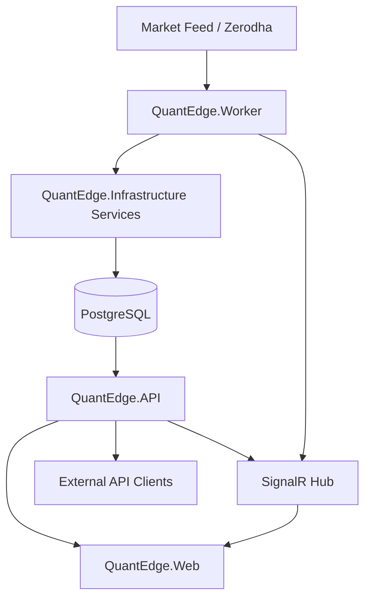

# QuantEdge Trading Platform

QuantEdge is a .NET 10 trading platform for market data ingestion, technical analysis, signal generation, paper trading, swing strategy scans, and operational dashboards.

The solution contains:
- A Web API for data, trading, admin, and auth endpoints
- An MVC Web app for dashboards and operations
- A Worker host that runs multiple background jobs by job type
- A shared Infrastructure layer (services, repositories, SQL integration)
- A Domain layer (entities and domain exceptions)

## 1. Solution Structure

Projects in the solution file:
- QuantEdge.API
- QuantEdge.Web
- QuantEdge.Worker
- QuantEdge.Infrastructure
- QuantEdge.Domain

High-level repository layout:

```text
QuantEdge/
  QuantEdge.API/              # ASP.NET Core Web API host
  QuantEdge.Web/              # ASP.NET Core MVC dashboard host
  QuantEdge.Worker/           # Background jobs host (Windows Service capable)
  QuantEdge.Infrastructure/   # Services, repositories, persistence SQL, SignalR hub
  QuantEdge.Domain/           # Domain entities and exceptions
  publish/                    # Published binaries per host
  linuxservicesetup.md        # Linux systemd setup guide
  windowserivcesetup.md       # Windows service setup guide
  signal_dashboard_flow_rules.md
  swing_trading_logic.md
```

## 2. Architecture Overview



Core design characteristics:
- Clean layered structure (Domain + Infrastructure + Hosts)
- Dependency Injection through ServiceCollection extension
- Dapper + Npgsql persistence with SQL procedures/functions
- SignalR for live push updates
- Background jobs selectable by command-line job type
- Serilog-based centralized logging setup per host

## 3. What Each Project Does

## QuantEdge.API
Primary REST API and SignalR host.

Key startup behavior:
- Registers controllers, Swagger, health checks, SignalR, CORS, memory cache
- Uses AddMarketDataServices for shared service/repository registration
- Applies path base /api
- Exposes /health endpoint with structured JSON
- Maps SignalR hub at /hubs/marketdata

Main controller modules:
- AuthController: login, register, password change
- ZerodhaAuthController: login-url, callback, headless login, session status
- MarketDataController: stocks, instruments, chart data, history reset/purge, memory stats
- TradingSignalController: on-demand signal evaluation
- PaperTradingController: account, positions, orders, settings, reset
- AutoTradeController: settings, toggle, dashboard, logs
- SwingTradingController: dashboard, job status, run job, backfill
- DataCoverageController: summary/list/export/update/delete/bulk delete
- HolidayController: holiday CRUD and cache refresh
- UserController: user summary/list/CRUD/reset-password
- CandleSummaryController: summary and symbol endpoints
- LogController: log file listing and content APIs

## QuantEdge.Web
MVC dashboard and operations UI layer.

Key startup behavior:
- Cookie auth
- Named HttpClient to API base URL (ApiBaseUrl)
- Uses AddMarketDataServices for shared domain services where needed

Main web controller modules:
- HomeController
- AccountController
- TokenController
- DataCoverageController
- HolidayController
- LogController
- ManageHistoryController
- CandleSummaryController
- PaperTradingController
- AutoTradingController
- SwingTradingController
- UserController

## QuantEdge.Worker
Background host that selects job(s) from JobType argument/config and can run as Windows service.

Job selection examples:
- marketdatafeed
- marketdatafeed:1m
- history
- history:5m
- instrumentsync
- activezerodhatoken
- swingintraday
- autotrade or autotradescan
- clearcache
- todayreset / historyreset / reset (aliases)

Important workers:
- MarketDataFeedWorker: market-hours-aware live stream loop and reconnect handling
- HistoricalDataSyncWorker: gap sync for missing historical candles
- InstrumentSyncWorker: startup/weekly instrument master sync
- ActiveZerodhaTokenWorker: token activation window checks (6:00-8:30 AM IST)
- AutoTradeSignalScanWorker: 15-minute scan loop over active stocks
- AutoTradePositionMonitorWorker: monitors open auto positions and exits
- SwingTradingIntradayJobWorker: 30-minute intraday swing scan
- SwingTradingDailyJobWorker: end-of-day swing job scheduler
- HistoryResetWorker: targeted date-range reset/rebuild
- TodayHistoryResetWorker: today reset/rebuild
- ClearCacheWorker: clears memory cache and exits

## QuantEdge.Infrastructure
Shared implementation layer:
- Extensions: DI registration
- Services: signal engine, swing engine, broker integrations, candle builder, cache, paper trading
- Interfaces: contracts for all services
- Persistence:
  - Connection factory
  - Repositories
  - SQL assets:
    - schema.sql
    - stored_procedures.sql
    - functions.sql
- Hubs: SignalR market data hub

## QuantEdge.Domain
Domain entities and exceptions.

Major entities include:
- MarketCandle, MarketIndicator, TradingSignal
- StockMaster
- IndianHoliday
- AppUser
- PaperAccount, PaperOrder, PaperPosition, PaperTradeHistory
- AutoTradeSettings, AutoTradeExecutionLog

## 4. Database and SQL Layer

Database engine:
- PostgreSQL (TimescaleDB-ready schema style)

SQL files and purpose:
- QuantEdge.Infrastructure/Persistence/schema.sql
  - Core table definitions
  - Migration blocks from old single-table model
  - Index creation
- QuantEdge.Infrastructure/Persistence/stored_procedures.sql
  - Insert/upsert procedures for candles/indicators/signals/sessions/holidays/users
- QuantEdge.Infrastructure/Persistence/functions.sql
  - Read/query functions for candles/indicators/signals/sessions/stock coverage and instruments

Data model highlights:
- Timeframe-specific candle tables: market_candles_1m/5m/15m/60m/1d
- Timeframe-specific indicator tables: market_indicators_1m/5m/15m/60m/1d
- Trading signal table
- Instrument master table (stock_master)
- Zerodha session table
- Holiday table
- Swing and analysis tables

## 5. Runtime Flows

Typical production flow:
1. Worker ingests live ticks and builds candles.
2. Infrastructure services compute indicators and evaluate signals.
3. Data is persisted to PostgreSQL via repositories and SQL procedures/functions.
4. API serves historical/operational endpoints.
5. API and Worker push live updates through SignalR.
6. Web dashboard consumes REST + SignalR for visualization and control.

Reference docs with detailed formulas and UI flow:
- signal_dashboard_flow_rules.md
- swing_trading_logic.md

## 6. Configuration

Each host has appsettings.json + appsettings.Development.json.

Primary configuration areas used across hosts:
- Logging
- MarketDataSettings:BrokerConfig
- AutoTrade
- ApiBaseUrl (Web)
- Enable_Swagger (API)

Example safe configuration template (do not commit real secrets):

```json
{
  "MarketDataSettings": {
    "BrokerConfig": {
      "ActiveBroker": "ZERODHA",
      "WebSocketUrl": "wss://ws.kite.trade",
      "ApiKey": "<set-in-secret-store>",
      "ApiSecret": "<set-in-secret-store>",
      "AccessToken": "<runtime-token>",
      "UserId": "<user-id>",
      "Password": "<set-in-secret-store>",
      "TotpSecret": "<set-in-secret-store>",
      "ConnectionString": "Host=<host>;Database=<db>;Username=<user>;Password=<password>;..."
    }
  },
  "AutoTrade": {
    "SignalScanIntervalMinutes": 15,
    "MaxTradesPerDay": 5,
    "TradingWindowStart": "09:15",
    "TradingWindowEnd": "15:30"
  }
}
```

Security note:
- Repository appsettings currently contains real-looking credentials/tokens.
- Move all secrets to user-secrets, environment variables, or secret manager immediately.
- Rotate any exposed credentials.

## 7. Local Development

Prerequisites:
- .NET SDK 10.0
- PostgreSQL 14+ (or compatible)

Build solution:

```bash
dotnet build QuantEdge.slnx
```

Run API:

```bash
dotnet run --project QuantEdge.API/QuantEdge.API.csproj
```

Run Web:

```bash
dotnet run --project QuantEdge.Web/QuantEdge.Web.csproj
```

Run Worker (examples):

```bash
dotnet run --project QuantEdge.Worker/QuantEdge.Worker.csproj -- marketdatafeed
dotnet run --project QuantEdge.Worker/QuantEdge.Worker.csproj -- history:1m
dotnet run --project QuantEdge.Worker/QuantEdge.Worker.csproj -- autotrade
```

Initialize database schema:

```bash
psql -U <username> -d <database> -f QuantEdge.Infrastructure/Persistence/schema.sql
psql -U <username> -d <database> -f QuantEdge.Infrastructure/Persistence/stored_procedures.sql
psql -U <username> -d <database> -f QuantEdge.Infrastructure/Persistence/functions.sql
```

## 8. Deployment

Publishing examples:

```bash
dotnet publish QuantEdge.API/QuantEdge.API.csproj -c Release -o publish/API
dotnet publish QuantEdge.Web/QuantEdge.Web.csproj -c Release -o publish/Web
dotnet publish QuantEdge.Worker/QuantEdge.Worker.csproj -c Release -o publish/Worker
```

Service setup references:
- Windows services: windowserivcesetup.md
- Linux systemd services: linuxservicesetup.md

## 9. Monitoring and Operations

API observability endpoints:
- /api/health
- /api/marketdata/memory-stats

Log handling:
- Serilog is configured in all three hosts
- Log browsing endpoints/controllers exist in both API and Web modules

Operational tools exposed in platform:
- Data coverage summary and export
- Instrument sync trigger
- History reset by symbol/timeframe/date range
- Holiday calendar management
- User management and password reset
- Token session activation and status checks

## 10. Current Notes

- QuantEdge.Worker includes Windows service integration via AddWindowsService.
- API uses path base /api, so all controller routes are served under /api/*.
- Swagger can be toggled by Enable_Swagger.
- Some documentation and comments still reference older naming such as QuantEdge.MarketData; current shared project is QuantEdge.Infrastructure.

## 11. Quick Start Checklist

1. Configure PostgreSQL and create database.
2. Apply schema.sql, stored_procedures.sql, and functions.sql.
3. Set BrokerConfig and connection string with secure secret storage.
4. Run API and Web.
5. Run Worker with required JobType (marketdatafeed, instrumentsync, autotrade, etc.).
6. Validate /api/health and open Web dashboard.
