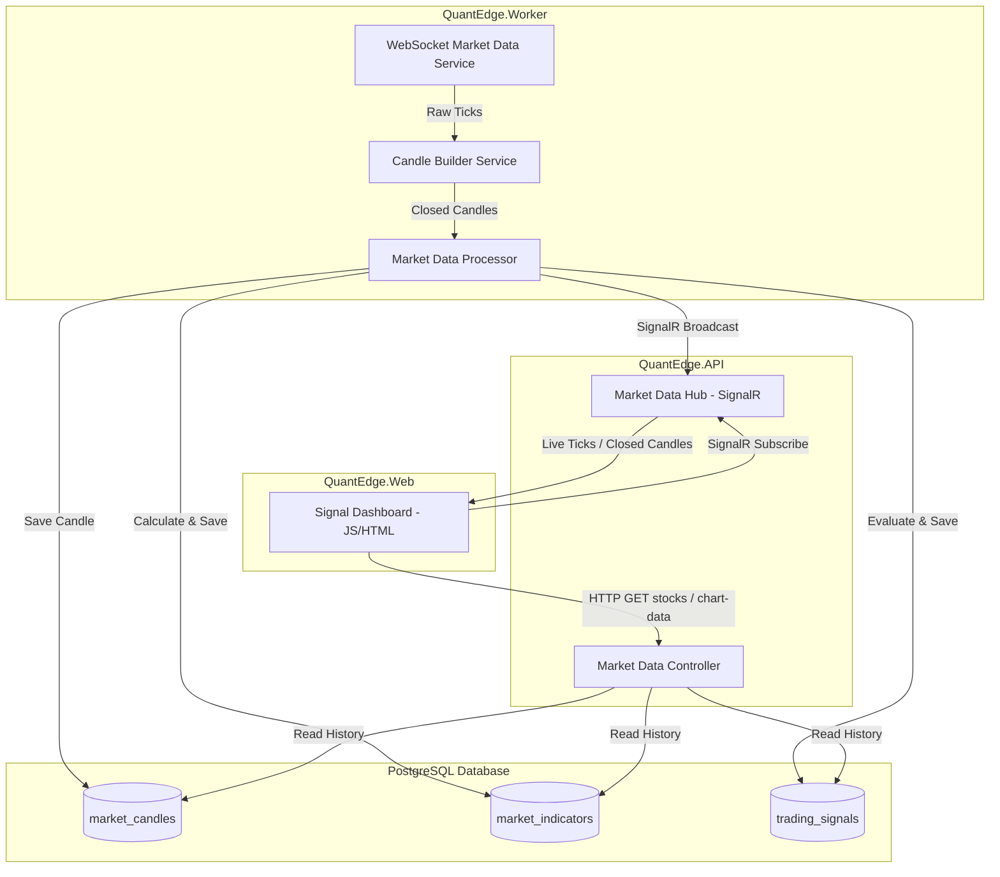
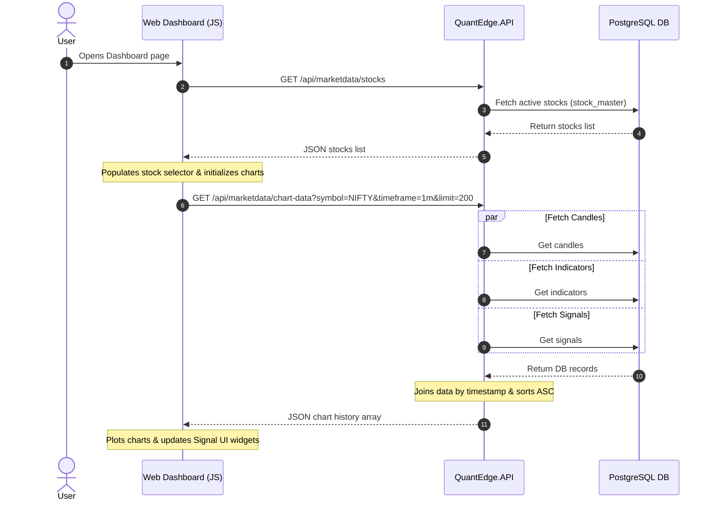

# QuantEdge Signal Dashboard: Flow & Rules Documentation

This document provides a detailed review of the **QuantEdge Signal Dashboard**, detailing the complete end-to-end data flow, system architecture, background processing pipeline, technical indicators, scoring algorithms, and UI presentation rules.

---

## 1. System Overview & Architecture

QuantEdge is a real-time trading platform designed with Clean Architecture principles in .NET 10. The Signal Dashboard integrates multiple modules to process real-time market ticks, calculate technical indicators, evaluate trading recommendations, and push live updates to the browser.

---

## 2. End-to-End Execution Flows

The dashboard operates through three primary workflows: **Initialization**, **Real-Time Streaming**, and **Background Tick Processing**.

### A. Initialization Flow (REST API)
When a user loads the dashboard in their browser:
1. **Load Stock List**: The dashboard (`dashboard.js`) makes an HTTP GET request to `/api/marketdata/stocks`.
   - The API queries the `stock_master` table and returns a list of active symbol-token pairs.
   - The UI populates the `#stockSelector` dropdown list (styled using Select2) and auto-selects the first symbol (e.g. `NIFTY`).
2. **Initialize Charts**: The UI initializes three synced instances of the **TradingView Lightweight Charts** library:
   - **Price Chart**: Displays candlesticks and overlay lines (EMA20, EMA50, VWAP).
   - **RSI Chart**: Displays a Relative Strength Index line with overbought/oversold boundaries.
   - **MACD Chart**: Displays MACD Line, Signal Line, and a color-coded Histogram.
3. **Fetch Historical Data**: The UI requests historical details for the selected symbol and timeframe via GET `/api/marketdata/chart-data?symbol={symbol}&timeframe={timeframe}&limit=200`.
   - The API fetches the records from PostgreSQL, merges them by timestamp (`candle_time`), sorts them chronologically (oldest first), and returns the payload.
   - The UI binds this data to the charts and calls `updateSignalUi` to configure the glowing Signal Card with the latest completed candle.

### B. SignalR Subscription Flow
1. Upon page initialization, the browser establishes a WebSocket connection to the SignalR hub: `${API_BASE_URL}/hubs/marketdata`.
2. When a stock symbol or timeframe is changed, the browser executes:
   - `connection.invoke("Unsubscribe", oldSymbol, oldTimeframe)` (if a subscription existed).
   - `connection.invoke("Subscribe", newSymbol, newTimeframe)`.
3. The hub adds the connection ID to a group named `{SYMBOL}_{TIMEFRAME}` (e.g. `NIFTY_1m`) for targeted broadcasts.

### C. Background Ingestion & Real-Time Broadcasting
The background pipeline aggregates incoming price ticks and pushes them to the browser:

```mermaid
sequenceDiagram
    autonumber
    participant Feed as Market Feed (WS)
    participant Processor as MarketDataProcessor
    participant CB as CandleBuilderService
    participant DB as PostgreSQL DB
    participant Hub as MarketDataHub (SignalR)
    participant UI as Web Dashboard (JS)

    Feed->>Processor: Stream raw tick
    Note over Processor: Validate trading hours & holiday list
    Processor->>CB: ProcessTickAsync(tick)
    Note over CB: Update active candle state
    CB-->>Processor: OnCandleUpdated (Real-time update)
    Processor->>Hub: Broadcast 'ReceiveActiveCandle'
    Hub->>UI: Stream live tick details
    Note over UI: Update active candle on chart & LTP widget

    Note over CB: Interval completes (Candle Closes)
    CB-->>Processor: OnCandleClosed (Completed candle)
    
    rect rgb(13, 25, 45)
        Note over Processor: Save Completed Candle & Calc Indicators
        Processor->>DB: Insert closed candle (sp_insert_market_candle)
        Processor->>DB: Calculate & Save latest indicators (EMA, RSI, MACD, VWAP)
        Processor->>Processor: Evaluate signal (SignalEngine)
        alt Signal is BUY or SELL (Score >= 50)
            Processor->>DB: Save generated signal (sp_insert_trading_signal)
        end
    end

    Processor->>Hub: Broadcast 'ReceiveClosedCandle'
    Hub->>UI: Stream completed candle + indicators + signal results
    Note over UI: Append candle to chart & update Signal Card glow
```

---

## 3. Session & Market Rules

Trading ticks are filtered using validation parameters inside `MarketHoursService`:

| Rule Parameter | Configuration | Details |
| :--- | :--- | :--- |
| **Time Zone** | India Standard Time (IST) | Handles system time conversions on Linux (`Asia/Kolkata`) and Windows (`India Standard Time`). |
| **Trading Days** | Monday to Friday | Ticks received on Saturdays and Sundays are ignored. |
| **Holidays** | Dynamic DB List | Checked against the `indian_holidays` database table. Cached with a **5-minute sliding timeout**; supports programmatic refresh. |
| **Session Timings** | **09:00 AM IST – 03:30 PM IST** | Encompasses Pre-Open (09:00 AM – 09:15 AM) and normal trading sessions (09:15 AM – 03:30 PM). Ticks outside these hours are discarded. |

---

## 4. Technical Indicator Calculations

Indicators are computed via `IndicatorCalculator` and `IndicatorService` upon candle closure using the latest 200 bars in PostgreSQL:

### A. Exponential Moving Average (EMA)
*   **Periods**: EMA(20) and EMA(50).
*   **Smoothing Factor ($\alpha$)**:
    $$\alpha = \frac{2}{Period + 1}$$
*   **Formula**:
    $$EMA_t = (Price_t \times \alpha) + (EMA_{t-1} \times (1 - \alpha))$$
*   **Seeding**: Initializes with a Simple Moving Average (SMA) of the first `Period` candles.
*   **Fallback**: If total historical bars < Period, falls back to calculating the running simple average of available data.

### B. Relative Strength Index (RSI)
*   **Period**: RSI(14).
*   **Smoothing**: Wilder's Smoothing Technique.
*   **Formula**:
    $$RSI = 100 - \left(\frac{100}{1 + \frac{Average\ Gain}{Average\ Loss}}\right)$$
*   **Seeding**: Initial 14 values default to a neutral RSI of `50`. Subsequent values apply smoothing:
    $$Average\ Gain_t = \frac{(Average\ Gain_{t-1} \times 13) + Gain_t}{14}$$
    $$Average\ Loss_t = \frac{(Average\ Loss_{t-1} \times 13) + Loss_t}{14}$$

### C. Moving Average Convergence Divergence (MACD)
*   **Fast Line**: 12-period EMA of Close price.
*   **Slow Line**: 26-period EMA of Close price.
*   **MACD Line**:
    $$MACD\ Line = EMA(12) - EMA(26)$$
*   **Signal Line**: 9-period EMA of the MACD Line.
*   **MACD Histogram**:
    $$Histogram = MACD\ Line - Signal\ Line$$

### D. Volume Weighted Average Price (VWAP)
*   **Reset**: Resets at the start of each calendar day (IST local date).
*   **Formula**:
    $$VWAP = \frac{\sum_{i=1}^n (Close_i \times Volume_i)}{\sum_{i=1}^n Volume_i}$$
    *Where $i$ represents candles on the same calendar day.*

---

## 5. Trading Signal Engine & Scoring System

The `SignalEngineService` and `SignalScoreCalculator` evaluate technical indicators at the end of each closed candle to determine buy, sell, or hold actions.

### Indicator Weights
Each technical indicator contributes to a total potential score of 100 points:

| Indicator / Condition | Max Weight |
| :--- | :---: |
| **Volume Spike** | 30 |
| **EMA Trend** | 20 |
| **MACD Crossover** | 20 |
| **RSI Momentum** | 15 |
| **VWAP Support/Resistance** | 15 |
| **Total** | **100** |

---

### A. Scoring Rules & Conditions

#### 1. EMA Trend (20 Points)
*   **BUY Condition (+20)**: EMA(20) > EMA(50) **AND** the gap between them is widening.
    $$\Delta_{current} = EMA(20)_t - EMA(50)_t$$
    $$\Delta_{previous} = EMA(20)_{t-1} - EMA(50)_{t-1}$$
    *Condition: $\Delta_{current} > \Delta_{previous}$*
*   **SELL Condition (+20)**: EMA(20) < EMA(50) **OR** EMA(20) slope turns negative ($EMA(20)_t < EMA(20)_{t-1}$).

#### 2. RSI Momentum (15 Points)
*   **BUY Condition (+15)**: RSI is in the momentum zone ($50 \le RSI \le 65$) **AND** rising ($RSI_t > RSI_{t-1}$).
*   **SELL Condition (+15)**: RSI is Overbought ($RSI > 70$) **OR** RSI momentum is failing ($RSI < 45$).

#### 3. MACD Crossover (20 Points)
*   **BUY Condition (+20)**: The MACD histogram crossed above the zero-line.
    *Condition: $Histogram_t > 0$ and $Histogram_{t-1} \le 0$*
*   **SELL Condition (+20)**: The MACD histogram is declining from a peak.
    *Condition: $Histogram_t < Histogram_{t-1}$*

#### 4. VWAP Support/Resistance (15 Points)
*   **BUY Condition (+15)**: Price is holding above VWAP.
    *Condition: $Price_t > VWAP_t$ and $Price_{t-1} > VWAP_{t-1}$*
*   **SELL Condition (+15)**: Price breaks below VWAP.
    *Condition: $Price_t < VWAP_t$*

#### 5. Volume Spike (30 Points)
*   **Baseline**: Average volume of the previous 20 candles ($AvgVol_{20}$).
*   **BUY Condition (+30)**: Bullish volume surge on a green candle.
    *Condition: $Volume_t > (AvgVol_{20} \times 1.5)$ and $Close_t > Open_t$*
*   **SELL Condition (+30)**: Bearish volume surge on a red candle.
    *Condition: $Volume_t > (AvgVol_{20} \times 2.0)$ and $Close_t < Open_t$*

---

### B. Signal Selection Logic
*   **BUY**: BuyScore $\ge 50$ **AND** BuyScore $\ge$ SellScore.
*   **SELL**: SellScore $\ge 50$ **AND** SellScore $>$ BuyScore.
*   **HOLD**: If neither condition is met (both scores are below 50).

*Note: Hold recommendations are displayed live on the dashboard but are **not** persisted to the `trading_signals` table in PostgreSQL.*

---

### C. Signal Strength Classification
The strength category is determined by the dominant signal's score:

| Score Range | Strength Category |
| :--- | :--- |
| **90 – 100** | Very Strong |
| **70 – 89** | Strong |
| **50 – 69** | Weak |
| **< 50** | None |

---

### D. UI Confidence Display
In `dashboard.js`, the score and signal type are mapped to user-friendly confidence indicators:

| Signal Type | Score Range | Display Text | Status Indicator Color |
| :--- | :--- | :--- | :--- |
| **HOLD** | Any | `Low (Hold) (Score%)` | Grey |
| **BUY / SELL** | 90 – 100 | `Very High (Score%)` | Green |
| **BUY / SELL** | 70 – 89 | `High (Score%)` | Green |
| **BUY / SELL** | 50 – 69 | `Moderate (Score%)` | Amber |
| **BUY / SELL** | < 50 (N/A) | `Low (Score%)` | Red |

---

## 6. Frontend Themes & Layout Elements

The frontend (`dashboard.css` and `dashboard.js`) changes elements dynamically to match the incoming data:

### A. Glowing Signal Card Styles
The primary indicator card updates its classes to display custom ambient glow effects:
*   **BUY Signal**:
    - **Styles**: Green gradient background (`linear-gradient(145deg, var(--bg-card), #0d1e17)`), glowing green shadow, green recommendation badge, and green progress circle.
*   **SELL Signal**:
    - **Styles**: Red gradient background (`linear-gradient(145deg, var(--bg-card), #220b0b)`), glowing red shadow, red recommendation badge, and red progress circle.
*   **HOLD Signal**:
    - **Styles**: Standard card background with subtle borders and grey details; no ambient glow.

### B. Quick Metric Widgets
Four secondary cards display indicators alongside status color pills:
*   **LTP / Price Change**: Calculates change against the open price of the active candle. Displays as green/bullish for positive changes and red/bearish for negative.
*   **RSI (14) Status**:
    - **Bullish (Green)**: RSI < 40 (Oversold).
    - **Bearish (Red)**: RSI > 60 (Overbought).
    - **Neutral (Grey)**: RSI between 40 and 60.
*   **VWAP Difference Status**:
    - **Bullish (Green)**: Price > VWAP.
    - **Bearish (Red)**: Price < VWAP.
*   **MACD Crossover Status**:
    - **Bullish (Green)**: MACD Line > Signal Line.
    - **Bearish (Red)**: MACD Line < Signal Line.
    - **Neutral (Grey)**: MACD Line = Signal Line (No Cross).

### C. Live Connection Badge
The badge reflects the SignalR connection status:
*   **Online**: Displays green text (`Connected`) and an active breathing green dot animation.
*   **Offline/Reconnecting**: Displays grey/amber text (`Disconnected` or `Reconnecting...`) with a static dot.
